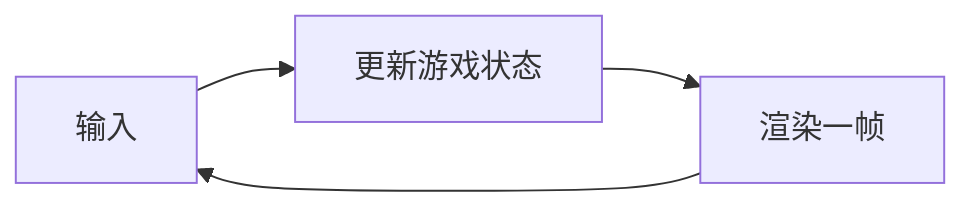
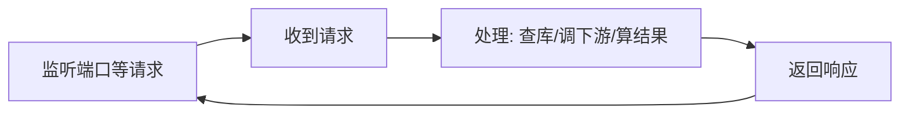
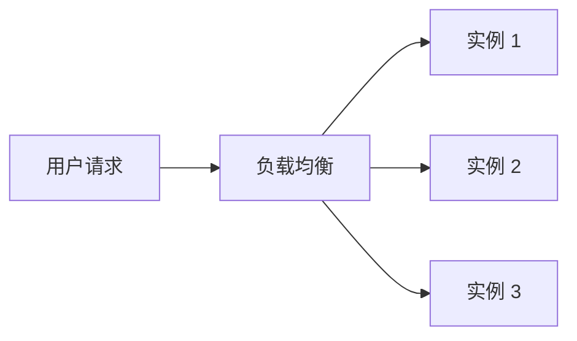
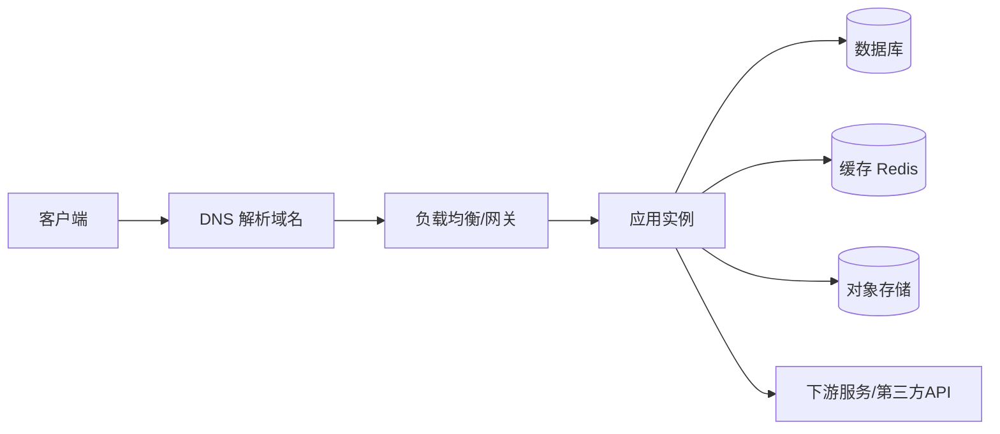

# 服务端开发全景

- 这一篇先建立心智模型：服务端到底和你熟悉的 native 引擎/客户端有什么本质不同。
- 后面所有篇章（协议、框架、数据库、集群、上线）都是在解决这一篇提出的问题。

## 一句话区别

- 客户端程序：为“一个用户、一台设备”服务，跑完一次就结束（或跟着这个用户的会话）。
- 服务端程序：一个长期不退出的进程，同时为“成千上万个互不相识的用户”服务，任何一刻都可能有很多请求在并发处理。

## 和游戏引擎主循环对比

- 游戏引擎是一个主循环：每帧读输入 → 更新状态 → 渲染，状态都在本机内存里，单用户独占。

- 服务端也是一个循环，但循环体是“等请求 → 处理请求 → 返回响应”，而且同一时刻有很多请求并行跑。

- 关键差异：
    - 引擎的状态在“这一局游戏”里连续存在；服务端的一次请求处理完，相关内存通常就该释放，下次请求是“全新的一次”。
    - 引擎单用户、单机；服务端多用户、且经常是多台机器一起扛。

## 服务端的几个核心心智

- 长期运行：进程一启动就要稳定跑几天、几周，内存泄漏/句柄泄漏会被时间放大，崩溃要能自动拉起。
- 并发：同一时刻多个请求在跑，共享的东西（数据库、缓存、全局变量）就有竞争，要考虑线程安全和数据一致性。
- 无状态优先：尽量不要把“用户的会话数据”存在某台服务器的内存里。原因见下。
- 横向扩展：扛不住了就加机器（多开几个一模一样的实例），而不是把单机配置堆到极限。

## 为什么强调“无状态”

- 服务端通常不是一台机器，而是同一份代码开了 N 个实例，前面用负载均衡把请求随机分给它们。

- 如果你把登录状态、购物车存在实例 1 的内存里，下一个请求被分到实例 2，数据就找不到了。
- 所以“状态”要放到大家都能访问的外部存储：数据库、Redis 缓存、对象存储。实例本身只做计算、不长期记东西。
- 这样任意一个实例挂了，请求被转到别的实例也照样能处理——这正是高可用和扩容的前提。

## 一次请求的完整链路（先有个全貌）

- 这张图里的每一块，后面都有独立篇章展开。现在只要记住：你写的业务代码（APP）只是中间一环，前面有网关、后面有各种存储和下游。

## 对你三个目标场景的预告

- 短视频特效下发：特效素材（大文件）放对象存储 + CDN，元数据放数据库，服务端发“去哪下载”的签名 URL。见实战 A。
- AIGC Workflow 编排：服务端把多个 AI 服务按 DAG 串起来，有同步/异步、分支、超时重试，本质是“服务端版的 workflow 调度器”。见实战 B。
- 团队 AI Agent：作为 Slack app 后端，接收事件、异步跑长任务、把结果回贴。见实战 C。

## 从 native 迁移过来最需要转变的点

- 不再是“我 new 出对象、我管生命周期”，而是“框架/容器创建对象、注入给我用”（依赖注入，后面 Spring 篇详谈）。
- 不再是“一切在我进程内”，而是“我依赖一堆网络上的东西”，于是延迟、超时、失败、重试成为日常，必须默认“调用会失败”。
- 性能不只看单次算得多快，更看“并发上来后还稳不稳”：吞吐、尾延迟、资源占用、能否水平扩展。

## 小结

- 服务端 = 长期运行 + 高并发 + 无状态 + 可横向扩展的请求处理程序。
- 把状态外置、把失败当常态、把“加机器”当扩容手段，是贯穿全教程的三条主线。
