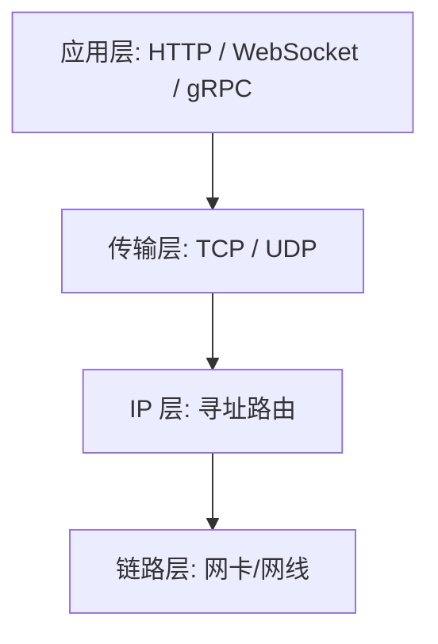
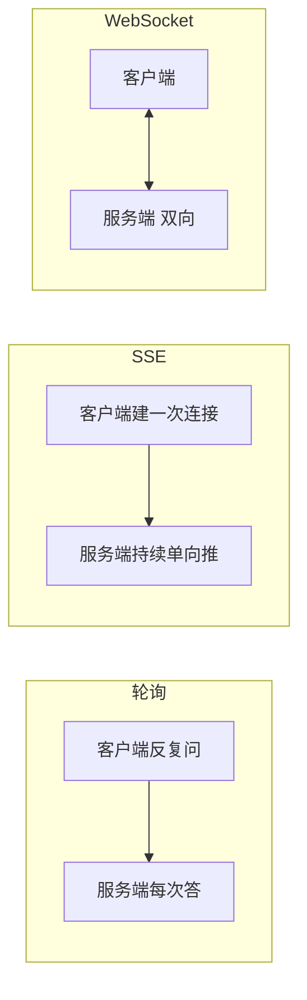

# 网络协议与连接形式

- 服务端的本质是“通过网络收发数据”，所以先把常见协议和连接形式理清楚：各自解决什么问题、什么时候用哪个。
- 不需要背 RFC，重点是建立“选型直觉”。

## 分层心智：从下到上

- 物理/链路层：网线、网卡，传比特，不用管。
- IP 层：负责“把数据包从一台机器送到另一台机器”，只认 IP 地址，不保证送到、不保证顺序。
- 传输层：TCP / UDP，在 IP 之上提供“端到端的数据通道”。
- 应用层：HTTP、WebSocket、gRPC 等，规定“这段数据是什么意思”。

## TCP vs UDP

- TCP：面向连接、可靠、有序。发出去的数据保证按顺序、不丢地到达（丢了会重传）。代价是要先“握手”建连接，有额外延迟。
    - 用在：绝大多数服务端场景（HTTP 就跑在 TCP 上）。要求数据完整、不能乱。
- UDP：无连接、不保证可靠、不保证顺序，但快、开销小。
    - 用在：实时音视频、游戏帧同步、DNS 查询——丢一两个包没关系，但要低延迟。
- 类比：TCP 像挂号信（保证签收、按序），UDP 像往窗外喊话（快，但可能没人听见）。

## TCP 的“握手”和连接成本

- TCP 建连要三次握手（来回打招呼确认），断开要四次挥手。这意味着每建一个新连接都有延迟成本。
- 所以服务端之间、客户端到服务端都倾向于复用连接（连接池、HTTP keep-alive），避免反复建连。这点在数据库连接池一篇还会重复出现。

## HTTP：服务端的主力协议

- HTTP 是“请求-响应”模型：客户端发一个请求，服务端回一个响应，然后这次交互就结束。
- 它是无状态的：服务端默认不记得你上次请求过什么（要记住就靠 Cookie/Token + 外部存储，见鉴权篇）。

### HTTP 版本演进（知道区别即可）

- HTTP/1.1：一个 TCP 连接上请求得排队（一个没回完，后面的等着，叫队头阻塞）。靠 keep-alive 复用连接。
- HTTP/2：一个连接上可以多路复用，多个请求并行不互相阻塞；头部压缩。对外接口默认走它居多。
- HTTP/3：底层从 TCP 换成基于 UDP 的 QUIC，进一步减少建连和队头阻塞延迟，弱网下更好。
- 对你来说：日常写业务感知不强（框架/网关处理），选型时知道“对外用 HTTP/2 起步、弱网移动端可上 HTTP/3”即可。

### HTTPS / TLS

- HTTPS = HTTP + TLS 加密。TLS 干三件事：加密（别人偷看不到内容）、完整性（内容没被篡改）、身份验证（证书证明你连的确实是这个域名）。
- 线上对外服务必须用 HTTPS。通常证书和 TLS 在最外层的网关/负载均衡上统一处理（叫 TLS 终止），内部服务之间可以用明文或内部 mTLS。

## 短连接 vs 长连接

- 短连接：每次请求建连、用完就断（早期 HTTP）。简单但建连开销大。
- 长连接：连接建好后保持着，多次请求复用（HTTP keep-alive、数据库连接池都是）。省去反复握手。
- 长轮询 / WebSocket / SSE：当需要“服务端主动推数据给客户端”时用，见下。

## 服务端如何把数据“推”给客户端

- HTTP 是客户端问、服务端答，服务端没法主动开口。但很多场景需要服务端推送（AIGC 生成进度、消息通知）。几种做法：

- 轮询（polling）：客户端隔几秒问一次“好了吗”。简单但浪费、有延迟。
- 长轮询（long polling）：客户端问一次，服务端先不回，等有结果了再回。比普通轮询省请求。
- SSE（Server-Sent Events）：基于 HTTP 的单向流，服务端可以持续往一个连接里推事件，客户端只收不发。适合“进度条、日志流、AI 流式输出”。
- WebSocket：在 HTTP 握手后升级成全双工长连接，双方都能随时发消息。适合聊天、协同编辑、实时互动。

- 选型直觉：
    - 只要进度/流式输出，单向就够 → SSE（最简单，对应你 AIGC 生成进度场景）。
    - 需要双向实时互动 → WebSocket。
    - 偶尔查一次状态、不要求实时 → 轮询足矣。

## gRPC：服务之间调用的常用选择

- gRPC 跑在 HTTP/2 上，用 Protobuf 做序列化（二进制，比 JSON 小、快），并且有强类型的接口定义（`.proto` 文件）。
- 适合“服务端内部服务之间”的高频调用（微服务间通信）。对外给浏览器/App 一般还是用 HTTP+JSON。
- 类比：对外是“说人话的 JSON 接口”，对内是“编译期就对齐协议的二进制 RPC”。

## 选型速查

- 对浏览器/App 的普通接口：HTTP/1.1 或 2 + JSON + HTTPS。
- 服务端推进度/流式：SSE。
- 双向实时：WebSocket。
- 内部服务间高频调用：gRPC（或内部 HTTP/JSON）。
- 实时音视频/游戏：UDP 系（一般你不用自己写）。

## 小结

- TCP 可靠有序、是 HTTP 的地基；UDP 快但不保证。
- HTTP 是请求-响应、无状态的主力协议，线上必须套 HTTPS。
- 服务端主动推数据：进度流用 SSE，双向用 WebSocket。
- 内部服务间通信常用 gRPC。
