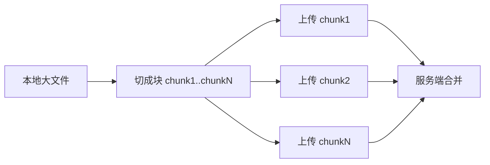
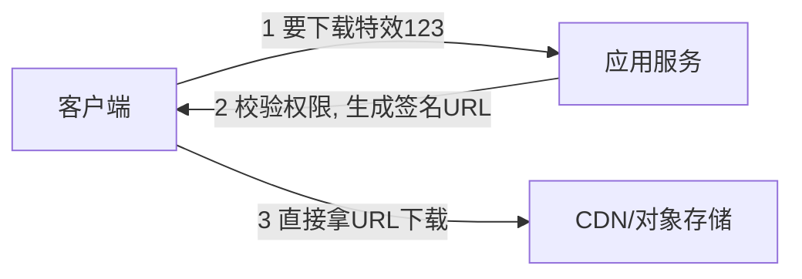

# 数据传输与大文件

- 服务端收发的数据分两类：结构化的小数据（JSON 等）和大块二进制（图片、视频、特效素材）。两类处理方式很不一样。
- 这一篇尤其和你的“短视频特效云端下发”场景相关。

## 结构化数据序列化

- 序列化 = 把内存里的对象变成能在网络上传输的字节；反序列化是反过来。
- 常见格式：
    - JSON：文本、人类可读、生态通用。对外接口默认选它。缺点是体积偏大、解析慢、没强类型。
    - Protobuf：二进制、需要 `.proto` 定义 schema，体积小、解析快、强类型。适合内部服务间高频通信（配 gRPC）。
    - MessagePack 等：二进制 JSON，折中方案。
- 选型直觉：对外 JSON，对内追求性能用 Protobuf。

## 别把大文件当 JSON 传

- 一个 50MB 的视频如果塞进 JSON（base64 编码）会膨胀约 33%，还要全部读进内存，既慢又吃内存。
- 大文件要走“二进制流 + 专门的上传下载通道”，而不是普通 JSON 接口。

## 大文件上传

- 基本方式：`multipart/form-data`，把文件作为一个二进制 part 发上来。
- 关键点：流式处理，别一次性读进内存。框架支持边收边写到磁盘/对象存储。

### 分块上传（大文件必备）

- 把文件切成多个块分别上传，每块独立、可并行、可重试。

- 好处：
    - 某块失败只重传那一块，不用整个文件重来（断点续传）。
    - 多块并行，更快。
    - 能显示上传进度。
- 典型流程：初始化上传（拿到 uploadId）→ 逐块上传（带块序号）→ 通知完成（服务端合并）。各大对象存储（S3、OSS）都内建了这套“分片上传”API。

## 大文件下发（你的核心场景）

- 错误做法：文件存数据库，或让应用服务器把文件读进内存再吐给用户。会撑爆应用、扛不住并发。
- 正确做法：文件放对象存储 + CDN，应用只负责发“去哪下载”的地址。

- 签名 URL（presigned URL）：应用服务生成一个带签名、有时效的临时下载链接。客户端拿它直接去对象存储/CDN 下载，不经过应用服务器。
    - 好处：流量不压在你的应用上；链接有有效期，过期失效，可控；可按用户/权限决定给不给链接。
- CDN：把素材缓存到离用户近的边缘节点，用户就近下载，又快又省源站带宽。特效这种“一次做好、大量用户重复下载”的内容，CDN 命中率极高。
- 这正是实战 A 的骨架，会在那篇落到代码。

## 断点续传下载

- 靠 HTTP 的 `Range` 头：客户端说“我要第 1000000 字节往后的内容”，服务端/对象存储返回 206 Partial Content。
- 网络中断后续传、视频拖动进度条加载，都靠它。对象存储和 CDN 默认支持，一般不用自己实现。

## 流式处理大数据

- 不只是文件——返回超大列表、导出报表、AI 流式输出，也要“流式”而不是“攒齐再发”。
- 服务端边算边写到响应流，客户端边收边处理，内存占用恒定，首字节更快。
- 对应工具：SSE（文本事件流）、HTTP chunked transfer、框架的流式响应（Spring 的 `StreamingResponseBody`、FastAPI 的 `StreamingResponse`）。

## 压缩

- 文本类响应（JSON、HTML）开 gzip/br 压缩，能显著减小体积。通常在网关层统一开。
- 已经压缩过的内容（图片 jpg、视频 mp4、zip）别再压，没用还浪费 CPU。

## 小结

- 小结构化数据：对外 JSON、对内 Protobuf。
- 大文件不要走 JSON：上传用分块（可断点续传），下载用对象存储 + CDN + 签名 URL，应用只发地址不当中转。
- 大数据返回用流式，配合 Range 实现断点续传。
