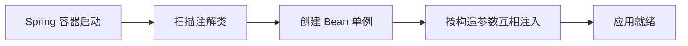
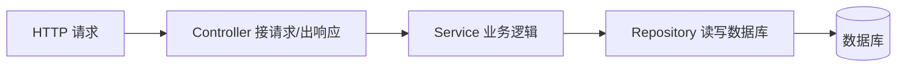

# Java 服务端框架：Spring Boot

- Java 后端事实上的标准是 Spring Boot。它把“写一个 HTTP 服务要操心的工程问题”（路由、配置、JSON、数据库连接、依赖管理）打包好，让你专注业务。
- 这一篇讲它的核心心智：分层、依赖注入、注解，并配一个可运行示例（见 `examples/05-spring-boot-rest`）。

## 先解决最大的认知障碍：依赖注入

- native 习惯：要用一个对象，自己 `new` 出来，自己管它的生命周期。
- Spring 习惯：你不 new，而是声明“我需要一个 UserService”，由 Spring 容器创建好、塞给你（注入）。
- 容器（IoC container）在启动时扫描你的类，把标了注解的类创建成单例对象（叫 Bean），并根据构造函数参数自动把它们接起来。



- 为什么这么设计：
    - 解耦：Controller 只依赖 Service 的接口，不关心它怎么 new、依赖了什么。
    - 易测试：测试时可以注入一个假的（mock）Service。
    - 统一管理：连接池、配置这种“全局只要一份”的东西，由容器统一持有。
- 这是从 native 迁移过来“魔法感”的根源：很多对象不是你创建的，是容器替你创建和管理的。

## 分层架构

- Spring 项目通常按职责分三层，请求自上而下流过：



- Controller：只做“翻译”——把 HTTP 请求解析成参数、调用 Service、把结果包成响应。不放业务逻辑。
- Service：放真正的业务逻辑，尽量不依赖 HTTP（这样能被复用、好测试）。
- Repository / DAO：只负责和数据库打交道。
- DTO：层与层之间、对外传输用的数据结构，常用 `record`。和数据库实体（Entity）分开，避免把内部结构泄露给外部。

## 一个最小 REST 接口长什么样

```java
// @RestController：告诉 Spring 这个类负责处理 HTTP 请求，返回值自动转成 JSON。
@RestController
@RequestMapping("/v1/effects")  // 这个类下所有接口的公共前缀
public class EffectController {

    private final EffectService effectService;

    // 构造函数注入：Spring 启动时把 EffectService 这个 Bean 传进来，
    // 你不用自己 new。这是推荐的注入方式（依赖看得见、便于测试）。
    public EffectController(EffectService effectService) {
        this.effectService = effectService;
    }

    // GET /v1/effects/123
    @GetMapping("/{id}")
    public EffectResponse getEffect(@PathVariable long id) {
        return effectService.getById(id);  // 返回的对象会被自动序列化成 JSON
    }

    // POST /v1/effects，请求体 JSON 自动反序列化成 CreateEffectRequest
    @PostMapping
    @ResponseStatus(HttpStatus.CREATED)  // 成功返回 201
    public EffectResponse create(@RequestBody @Valid CreateEffectRequest req) {
        return effectService.create(req);
    }
}

// DTO 用 record 最省事：不可变、自动有构造/getter/equals。
public record CreateEffectRequest(String name, String category) {}
public record EffectResponse(long id, String name, String category) {}
```

```java
// @Service：标记这是业务层 Bean，会被容器创建并可注入到别处。
@Service
public class EffectService {
    private final EffectRepository repository;

    public EffectService(EffectRepository repository) {
        this.repository = repository;
    }

    public EffectResponse getById(long id) {
        Effect e = repository.findById(id)
            // 找不到就抛业务异常，由统一异常处理转成 404（见下）
            .orElseThrow(() -> new NotFoundException("effect " + id));
        return new EffectResponse(e.getId(), e.getName(), e.getCategory());
    }
    // ...create 略
}
```

## 注解到底是什么

- 注解（`@RestController`、`@GetMapping` 等）只是“贴在类/方法上的元数据标签”，本身不执行任何逻辑。
- 是 Spring 在启动/运行时扫描这些标签，据此注册路由、创建对象、注入依赖、开启事务。
- 看到陌生注解就问两个问题：哪个框架读它？它改变了什么行为？这样就不会觉得是黑魔法。

## 横切关注点：过滤器与拦截器

- 很多事情每个请求都要做：鉴权、日志、限流、设置 traceId。不该写在每个 Controller 里，而是抽到“拦截层”统一做。
- Filter（Servlet 过滤器）：最外层，能拿到原始请求/响应，适合日志、鉴权、压缩。
- Interceptor（Spring 拦截器）：在进入 Controller 前后，能拿到将要执行的处理器信息。
- AOP：用切面在方法前后插逻辑（如统计耗时、统一事务）。
- 心智：这些就是“请求流水线上的中间件”，和你在网关里做的事是同一种思路，只是粒度更细。

## 统一异常处理

- 别在每个接口里 try-catch 拼错误响应。用 `@RestControllerAdvice` 集中把异常转成统一错误结构（呼应 API 设计篇的错误体）。

```java
@RestControllerAdvice
public class GlobalExceptionHandler {
    @ExceptionHandler(NotFoundException.class)
    @ResponseStatus(HttpStatus.NOT_FOUND)  // 404
    public ErrorResponse handle(NotFoundException e) {
        return new ErrorResponse("NOT_FOUND", e.getMessage());
    }
}
```

## 配置

- 配置写在 `application.yml`，按环境分 `application-dev.yml`、`application-prod.yml`，启动时用 profile 选择。
- 敏感信息（密码、密钥）用环境变量或配置中心注入，不写进文件提交仓库（见配置篇）。

```yaml
server:
  port: 8080
spring:
  datasource:
    url: jdbc:postgresql://localhost:5432/app
    username: ${DB_USER}      # 从环境变量读，不硬编码
    password: ${DB_PASSWORD}
```

## Spring 生态里你会反复遇到的模块

- Spring Web：写 REST 接口（上面那些注解）。
- Spring Data JPA / MyBatis：访问数据库。
- Spring Security：认证授权。
- Spring Boot Actuator：健康检查、指标（部署和可观测篇要用）。
- Spring Cloud：微服务相关（网关、配置中心、服务发现）。

## 小结

- Spring Boot 的核心是依赖注入容器：对象由容器创建和注入，你专注业务。
- 标准分层 Controller / Service / Repository，DTO 与 Entity 分离。
- 注解是给框架读的元数据，不是魔法。
- 横切逻辑（鉴权/日志/异常）集中到过滤器、拦截器、AOP、统一异常处理。
- 可运行示例见 `examples/05-spring-boot-rest`。
