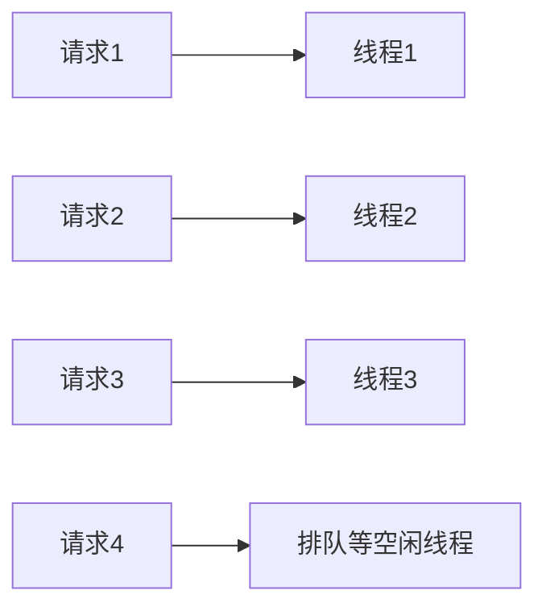
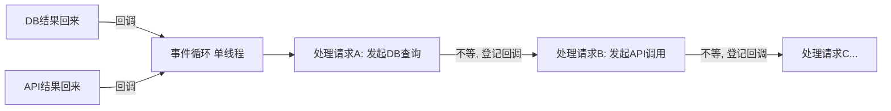

# 同步 vs 异步与并发模型

- 服务端要同时处理大量请求，“怎么并发”直接决定吞吐和资源占用。
- 这一篇讲两种主流并发模型（线程池 vs 事件循环）、阻塞 vs 非阻塞、以及它们和你 AIGC 编排场景的关系。

## 先分清两组容易混的概念

- 同步 / 异步：调用方要不要“干等着结果”。同步=发起后原地等返回；异步=发起后先去干别的，结果好了再回来处理。
- 阻塞 / 非阻塞：发起 IO 操作时，当前执行单元（线程）是“卡住啥也不干”还是“能去干别的”。
- 并发 / 并行：并发=同时管很多任务（可能轮流推进）；并行=真的同一时刻多个在跑（多核）。

## 服务端的瓶颈通常是“等”，不是“算”

- 一次请求的时间，大头往往花在等数据库、等下游 API、等磁盘——CPU 大部分时间在闲着等 IO。
- 所以并发模型的核心目标：等 IO 的时候，别让昂贵的执行资源（线程/进程）干耗着，让它去服务别的请求。

## 模型一：每请求一线程 + 线程池（Java/Spring 传统模型）

- 来一个请求，从线程池借一个线程处理它，处理完归还。线程池大小有限。



- 优点：编程模型简单，代码顺序写下来就行（同步阻塞写法）。
- 痛点：线程不是免费的（每个占内存、切换有成本）。如果每个请求都在等 IO，线程就被“占着等”，并发量一高线程池就被占满，新请求排队。
- 经验：线程数不是越多越好，太多反而因上下文切换和内存拖垮系统。

## 模型二：事件循环 + 非阻塞 IO（Node/FastAPI async/Netty）

- 单个（或少量）线程跑一个事件循环：发起 IO 后不等，登记一个回调就去处理下一个任务；IO 完成了事件循环再回来继续。



- 优点：少量线程就能扛海量“等待型”连接，内存省、无线程切换开销。
- 痛点：
    - 不能在事件循环里做“阻塞”或“重 CPU 计算”的事——会卡住整个循环，所有请求都被拖住。
    - 代码是回调/async-await 风格，心智略复杂（但 async/await 已经让它接近同步写法）。

## async/await 本质

- async/await 是事件循环模型的“语法糖”：让异步代码看起来像同步代码，但 `await` 处其实是“挂起当前任务、把线程让出去干别的”。

```python
# 看起来是顺序的三步，但每个 await 处都把控制权交还事件循环，
# 这个请求在等的时候，同一线程可以去推进别的请求。
async def handle():
    user = await db.get_user(id)        # 等 DB 时不占着线程
    profile = await api.get_profile(user)  # 等下游时不占着线程
    return combine(user, profile)
```

- 关键纪律：async 函数里只能 `await` 异步库；如果调了一个同步阻塞的库（或做大量 CPU 计算），整个事件循环会被卡住。这类活要丢到线程池/进程池里执行。

## Java 这边的新进展：虚拟线程

- 传统 Java 是“每请求一个 OS 线程”，贵。
- JDK 21 的虚拟线程：可以创建海量轻量线程，阻塞时由 JVM 自动让出底层 OS 线程。等于“用同步阻塞的写法，拿到接近事件循环的并发能力”。
- 意义：以后 Java 后端可以继续写简单的同步代码，同时获得高并发，不必被迫上复杂的响应式编程。

## CPU 密集 vs IO 密集，模型怎么选

- IO 密集（大量等网络/磁盘，如 AIGC 编排、聚合多个下游）：事件循环/async 或虚拟线程最划算。
- CPU 密集（大量计算，如图像处理、编码）：并发模型帮不上忙——瓶颈是核数。要靠多进程/多机分摊，并把重活从请求线程里挪走（丢给后台 worker / 消息队列）。
- Python 特别注意：有 GIL，单进程多线程不能真正并行跑 CPU；CPU 活要用多进程，或交给别的服务。

## 落到你的 AIGC 编排场景

- 编排服务大量时间在等多个 AI 服务返回，是典型 IO 密集。
- 用 async（FastAPI）能让一个进程同时推进很多个生成任务的“等待”，并发发起、并发等待。
- 但要点：
    - 真正的重计算（如本地跑模型）不要放在编排进程里，交给专门的 GPU 服务。
    - 长任务（几十秒以上的生成）不要让 HTTP 请求一直挂着等，改成“先返回任务 id，异步处理，完成后回调/SSE 通知”（见编排篇和消息队列篇）。

## 小结

- 服务端瓶颈多在“等 IO”，并发模型的目标是等的时候别占着执行资源。
- 线程池模型简单但线程贵；事件循环/async 用少量线程扛海量等待，但怕阻塞和重计算。
- Java 虚拟线程让同步写法也能高并发。
- IO 密集用 async/虚拟线程，CPU 密集靠多进程/多机并把重活移出请求路径。
