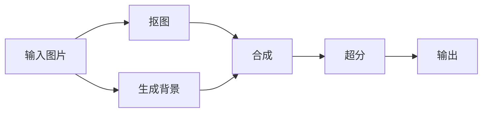
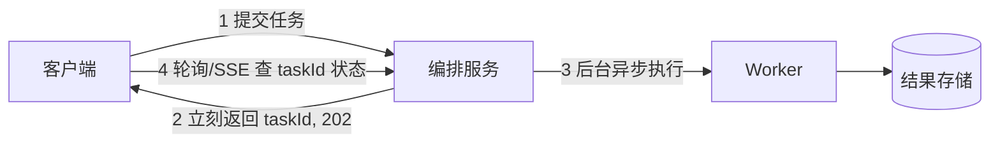

# 服务端编排与任务流

- 编排 = 在服务端把多个下游调用（其他服务、AI service、数据库）按一定逻辑串起来，并处理好失败、超时、重试、并发、分支。
- 这一篇直接对应你的 AIGC Workflow 场景，也和 FE 教程里的异步编程篇是同一套思想，只是搬到了服务端。
- 配可运行示例见 `examples/08-orchestration`。

## 为什么编排是个专门的话题

- 单个调用很简单。难点在“组合”：
    - 多个调用有的能并行、有的有先后依赖。
    - 任何一个下游都可能慢、可能失败、可能超时。
    - 总耗时、单步耗时要能统计。
    - 有的分支要根据上一步结果决定走不走。
- 把这些处理好，编排模块才稳定，否则一个下游抖动就拖垮整条链路。

## 串行 vs 并行

- 有依赖就串行（B 需要 A 的结果）；无依赖就并行（同时发起，一起等），能显著缩短总耗时。

```mermaid
flowchart LR
    subgraph 串行 总耗时=A+B+C
    A1[A] --> B1[B] --> C1[C]
    end
    subgraph 并行 总耗时=max A,B,C
    S[开始] --> A2[A]
    S --> B2[B]
    S --> C2[C]
    A2 --> E[汇总]
    B2 --> E
    C2 --> E
    end
```

```python
import asyncio

# 串行：必须等 A 完才能用它的结果调 B
async def serial():
    a = await call_a()
    b = await call_b(a)   # 依赖 a
    return b

# 并行：A、B、C 互不依赖，一起发起、一起等，总耗时取决于最慢的那个
async def parallel():
    a, b, c = await asyncio.gather(call_a(), call_b(), call_c())
    return combine(a, b, c)
```

## 把工作流抽象成 DAG

- 复杂编排本质是一张有向无环图（DAG）：节点是任务，边是依赖。调度器按依赖关系决定执行顺序，没有依赖关系的节点并行跑。
- 这和你做 AIGC workflow 链路、以及 FE 里画节点编辑器是同一个模型。



- 调度器要做的事：找出当前“依赖都已完成”的节点 → 并发执行它们 → 完成后再看谁的依赖满足了 → 重复，直到全部完成。

## 必须处理好的几件事

### 超时

- 每个下游调用都要设超时。否则一个卡住的下游会让你的请求无限等待，连锁占满资源（叫雪崩）。

```python
# 给单个调用设超时，超了就当失败处理
try:
    result = await asyncio.wait_for(call_ai_service(), timeout=30)
except asyncio.TimeoutError:
    ...  # 走失败/降级逻辑
```

### 重试与退避

- 临时性失败（网络抖动、下游 503）可以重试，但要指数退避（等待时间逐次翻倍），避免一拥而上把下游压垮。
- 只重试“可安全重试”的操作（幂等的）。非幂等的（扣费、创建）要配幂等键，见 API 设计篇。

```python
async def with_retry(fn, attempts=3):
    for i in range(attempts):
        try:
            return await fn()
        except TransientError:
            if i == attempts - 1:
                raise
            await asyncio.sleep(0.2 * 2 ** i)  # 200ms, 400ms, 800ms 退避
```

### 并发限制

- 不能无限并发地打下游（会打爆它，也会耗尽自己的连接）。用信号量限制同时进行的数量。

```python
sem = asyncio.Semaphore(5)  # 最多同时 5 个

async def limited(task):
    async with sem:          # 拿不到名额就排队等
        return await task()
```

### 失败处理策略

- 快速失败：任一关键步骤失败，整体失败并返回。
- 降级：非关键步骤失败时用默认值/缓存继续（如个性化推荐挂了就给热门）。
- 部分成功：返回成功的部分 + 失败的标记，让调用方决定。
- 补偿/回滚：已经产生副作用的步骤失败时，要不要撤销前面的（涉及事务/Saga，见数据库篇）。

### 耗时统计

- 给每一步打点（开始/结束时间），记录单步耗时和总耗时。既能返回给调用方，也能进监控找瓶颈。
- 配合链路追踪（traceId + span），能看到一次编排里每个下游分别花了多久（见可观测篇）。

## 同步返回 vs 异步任务

- 短任务（几秒内）：HTTP 请求里同步等完，直接返回结果。
- 长任务（几十秒到几分钟，如大模型生成）：不要让 HTTP 连接一直挂着等。



- 这就是 API 设计篇说的 202 Accepted：先收下、给 taskId，后台慢慢跑，客户端用 SSE 看进度或轮询查状态。
- 长任务和重计算应该交给后台 worker（配消息队列），而不是占着 web 进程，见消息队列篇。

## 进程内编排 vs 工作流引擎

- 简单编排：上面这些代码在你的服务进程里写就够了（本篇示例就是）。
- 复杂、长周期、要持久化和可视化的工作流：用专门的工作流引擎（如 Temporal、Airflow、Argo），它们帮你做状态持久化、断点续跑、重试、可观测。
- 选型直觉：一次请求内就能跑完的轻量编排自己写；跨越分钟/小时、要可靠恢复的用引擎。

## 小结

- 编排的难点是组合下游：并行无依赖项、串行有依赖项，复杂场景抽象成 DAG 调度。
- 每个下游都要有超时、重试退避、并发限制；想清楚失败策略（失败/降级/部分成功/补偿）。
- 长任务转异步：返回 taskId + 进度查询，重活交后台 worker。
- 复杂持久工作流用专门引擎。
- 可运行示例见 `examples/08-orchestration`。
