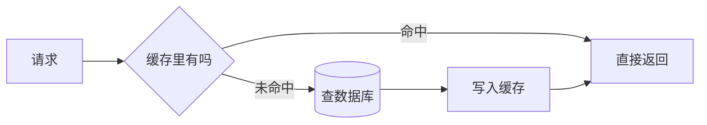

# NoSQL 与缓存

- 关系型数据库是默认，但有些场景它不擅长或太慢。这时用 NoSQL 和缓存补位。
- 重点掌握 Redis，它在后端无处不在。

## NoSQL 是个大类，不是一种东西

- NoSQL = “非关系型”，按数据模型分几类：
    - 键值（KV）：Redis、Memcached。一个 key 对一个 value，极快。
    - 文档：MongoDB。存 JSON 文档，schema 灵活。
    - 列式：Cassandra、HBase。海量写入、宽表。
    - 图：Neo4j。专门存关系网络（社交、推荐）。
- 共同取舍：通常牺牲一部分关系型的能力（复杂关联、强事务）来换取某方面的极致（速度、扩展性、灵活性）。

## 什么时候用 NoSQL

- 数据结构不固定、字段经常变 → 文档库（MongoDB）。
- 超高并发的简单读写、要极低延迟 → KV（Redis）。
- 海量时序/日志数据、写多 → 列式。
- 关系网络查询（多跳） → 图库。
- 反过来：只要数据有清晰关系、要事务、要复杂查询，还是回到关系型。别因为“新”就上 NoSQL。

## 缓存：最常用的性能手段

- 缓存 = 把“算/查起来贵、又经常被读”的结果暂存到快的地方（内存/Redis），下次直接拿，不再打数据库。
- 典型收益：数据库压力骤降，响应从几十毫秒降到毫秒级。



## Redis 是什么

- 一个跑在内存里的 KV 存储，单线程但极快（每秒十万级操作）。后端用它干很多事，不止缓存：
    - 缓存：缓存热点数据、查询结果。
    - 会话存储：放登录态（呼应无状态——状态外置到 Redis，任意实例都能读）。
    - 分布式锁：多个实例抢一个资源时协调。
    - 计数器/限流：原子自增做限流、计数。
    - 简单消息队列：list/stream 做轻量队列。
    - 排行榜：有序集合（zset）。

```text
SET effect:123 "{...json...}" EX 300   # 存并设 300 秒过期
GET effect:123                          # 取
INCR rate:user:1                        # 原子自增，做计数/限流
```

## 缓存的核心难题：一致性

- 数据库的数据变了，缓存里还是旧的，就出现“脏数据”。处理策略：
- 设过期时间（TTL）：最简单，容忍短暂不一致。绝大多数场景够用。
- 写时更新/删除缓存：改完数据库后顺手删掉缓存（下次读自动回填）。推荐“先写库、再删缓存”。
- 经验：能容忍短暂不一致就用 TTL；要求改完立刻生效就主动删缓存。

## 缓存的三个经典坑

- 缓存穿透：查一个根本不存在的 key，每次都穿过缓存打到数据库。对策：把“不存在”也缓存一个空值，或用布隆过滤器挡掉。
- 缓存击穿：某个热点 key 突然过期，瞬间大量请求同时打数据库。对策：热点 key 不过期或加互斥锁，只让一个请求去回填。
- 缓存雪崩：大量 key 同一时刻集中过期，数据库被打垮。对策：过期时间加随机抖动，别让它们一起到期。

## 分布式锁（多实例协调）

- 场景：多个服务实例可能同时处理同一件事（如同一个任务被重复领取）。需要“同一时刻只有一个实例能做”。
- 用 Redis 的 `SET key value NX EX 10`：NX 保证只有第一个能设成功（拿到锁），EX 设过期防止持锁实例崩了锁不释放。
- 注意：分布式锁有很多边界情况（锁过期了任务还没完、误删别人的锁），生产建议用成熟库（Redisson 等），别手搓。

## 缓存放在哪一层

- 本地缓存（进程内，如 Caffeine）：最快，但每个实例各存一份、容易不一致、重启就没。适合极热、可短暂不一致的小数据。
- 分布式缓存（Redis）：所有实例共享一份，一致性好、可持久。最常用。
- 常见组合：本地缓存挡住绝大多数读 + Redis 兜底，叫多级缓存。

## Redis 使用边界

- Redis 很快，但不是默认主数据库。它通常用来放“可重建、可过期、可短暂不一致”的数据。
- 重要业务状态要落关系型数据库；Redis 挂了或 key 被淘汰时，系统要能从数据库恢复。
- 给 key 设计命名规则和 TTL：如 `effect:{id}`、`slack:evt:{event_id}`，避免无期限堆积。
- 关注内存和淘汰策略：Redis 内存满了可能按策略淘汰 key，别把“必须不丢”的数据只放 Redis。
- 热 key 会让单个 Redis 实例压力集中，特别热的数据可以用本地缓存、多副本或拆 key 分散压力。

## 小结

- NoSQL 按模型分 KV/文档/列式/图，各自牺牲一些换某方面极致；有关系、要事务仍回关系型。
- 缓存是头号性能手段：命中直接返回，未命中查库再回填。
- Redis 不只是缓存：会话、分布式锁、限流、队列、排行榜都用它。
- 缓存的难点是一致性（用 TTL 或主动删）和三个坑（穿透/击穿/雪崩）；重要状态不要只放 Redis。
