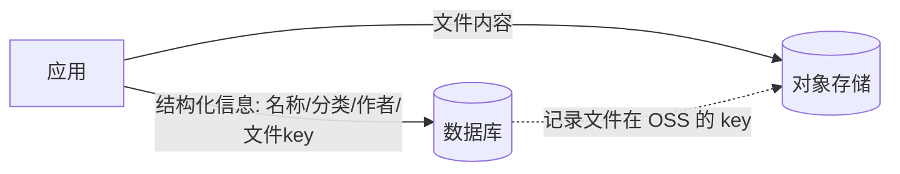
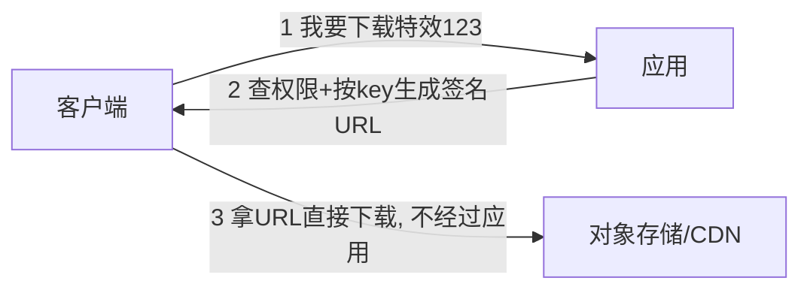
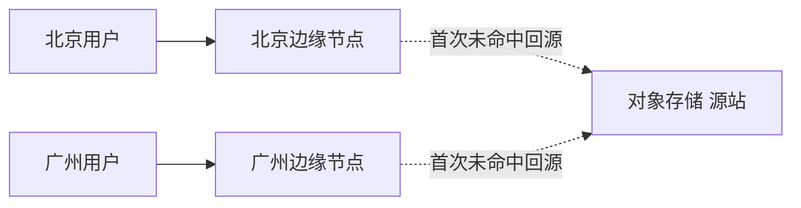
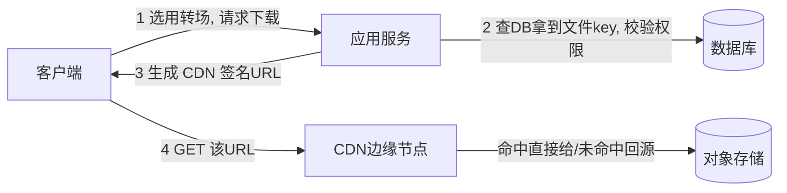

# 对象存储与 CDN

- 数据库适合存结构化小数据，不适合存大文件（图片、视频、特效素材）。大文件归对象存储管。
- 这一篇是你“短视频特效云端存储与下发”场景的存储底座，实战 A 会用到。

## 对象存储是什么

- 一种专门存“文件”（叫对象）的服务：你给它一个 key（路径名）和文件内容，它帮你存、帮你扛海量和高并发下载。
- 代表：AWS S3、阿里云 OSS、腾讯云 COS、MinIO（可自建，S3 兼容）。API 大同小异。
- 特点：
    - 容量近乎无限、按用量付费。
    - 高可用、自动多副本、不怕单机挂。
    - 通过 HTTP 直接读写，天然适合给 CDN 做源站。

## 对象存储 vs 文件系统 vs 数据库

- 别把大文件存数据库：撑大库、备份慢、读写都吃应用内存。
- 别存应用服务器本地磁盘：换机器/多实例就丢了，不符合无状态。
- 对象存储：扁平的 key-对象 结构（没有真正的目录树，`a/b/c.mp4` 只是 key），专为大文件和高并发分发设计。

## 元数据放数据库，文件放对象存储

- 这是标准分工：

- 数据库存：特效名、分类、作者、大小、以及“文件在对象存储里的 key”。
- 对象存储存：真正的特效素材二进制。
- 查列表/详情走数据库；要下载时，根据 key 生成下载地址。

## 签名 URL：安全地把下载/上传直接交给对象存储

- 核心思想：应用服务器不当文件中转站，只负责“发通行证”。

### 下载（下发场景）

- 签名 URL：带签名和过期时间的临时链接。对象存储验证签名有效且没过期，才允许下载。
- 好处：
    - 流量不压在应用上（应用只发个字符串）。
    - 链接有时效，过期作废，可防盗链。
    - 是否发链接由应用控制（鉴权、付费校验都在这一步）。

### 上传

- 同理：应用生成“签名上传 URL”，客户端拿它直接把文件 PUT 到对象存储，不经过应用。大文件用前面讲的分片上传。

## CDN：让下载又快又省

- CDN（内容分发网络）= 在全球/全国各地放一堆缓存节点（边缘节点），把素材缓存到离用户最近的地方。

- 工作方式：用户请求素材 → 就近的边缘节点有缓存就直接给（命中）；没有就回源站（对象存储）取一次、缓存下来，后续请求都走缓存。
- 为什么特别适合你的场景：特效是“一次做好、海量用户重复下载”的静态内容，CDN 命中率极高——既快（就近）又省（源站带宽和压力大减）。
- 缓存更新：素材更新了要让 CDN 失效旧缓存。最佳实践是文件名带版本/哈希（`transition-v2.zip`），更新即换 URL，天然绕开缓存问题（和 FE 静态资源 hash 命名同理）。

## 一次特效下发的完整链路

## 成本与治理（知道有这些考量）

- 对象存储分存储费、流量费、请求次数费。大流量下发，CDN 能显著降低源站流量费。
- 存储分级：热数据放标准存储，很少访问的老素材转低频/归档存储省钱。
- 生命周期规则：自动清理临时文件、过期上传。

## 小结

- 大文件归对象存储，元数据归数据库，按 key 关联，这是标准分工。
- 应用不当文件中转站：用签名 URL 让客户端直连对象存储上传/下载，应用只发通行证并在这一步做鉴权。
- CDN 把素材缓存到离用户近的边缘节点，特效这种静态重复下载内容收益巨大；用带版本的文件名解决缓存更新。
