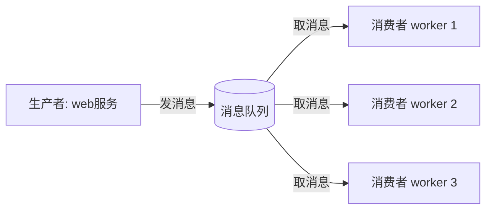
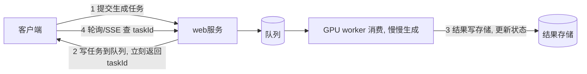

# 消息队列与异步任务

- 前面编排篇说过：长任务、重计算不该占着 web 请求线程，要丢到后台异步处理。消息队列就是干这个的基础设施。
- 它还解决服务之间“解耦”和“削峰”的问题。

## 消息队列解决什么

- 解耦：生产者只管把消息扔进队列，不关心谁来处理、处理多久。消费者自己来取。两边互不依赖、可独立部署和扩容。
- 削峰：流量突增时，请求先堆在队列里，消费者按自己的节奏慢慢处理，不会瞬间把下游打垮。
- 异步：生产者扔完就返回，不等处理完成（长任务必备）。

## 一个典型场景：长任务异步化

- 你的 AIGC 生成可能要几十秒。同步等会占死连接、超时。改成队列：

- web 服务只负责“收任务、入队、返回 taskId”，毫秒级返回；真正的重活由独立的 worker 池消费，可单独扩容（缺算力就加 worker）。

## 两类主流产品

- 消息队列（RabbitMQ、Redis Stream、云厂商 MQ）：偏“任务分发”，消息被一个消费者处理掉就没了。适合后台任务、异步处理。
- 消息流/日志（Kafka、Pulsar）：偏“事件流”，消息按顺序持久保存，可被多个消费组各自从头消费。适合数据管道、事件溯源、多方订阅同一份事件。
- 选型直觉：
    - 就是想把任务丢给后台慢慢做 → RabbitMQ / 云 MQ / 简单的话 Redis 队列。
    - 一份事件要给多个下游消费、要可回溯、超大吞吐 → Kafka。

## 投递语义：至少一次 / 最多一次 / 恰好一次

- 至少一次（at-least-once）：保证不丢，但可能重复投递（最常用）。
- 最多一次：不重复，但可能丢（很少用）。
- 恰好一次：理想但代价高，实际多用“至少一次 + 消费端幂等”来逼近。
- 关键纪律：因为可能重复投递，消费者处理必须幂等（呼应 API 设计篇的幂等键）。重复消费一条消息不能产生两次副作用。

## 必须处理的几件事

- 确认机制（ack）：消费者处理成功后才告诉队列“这条做完了”，队列才删除它。处理失败/没 ack，消息会被重新投递，保证不丢。
- 重试与死信队列：消息反复处理失败（如数据本身有问题），不能无限重试堵住队列。重试几次还失败就扔进死信队列（DLQ）单独排查，主流程继续。
- 消息顺序：大多数队列不保证全局顺序。需要顺序时用“同一 key 进同一分区”（Kafka）等手段，且要清楚这会限制并发。
- 积压监控：消费速度跟不上生产，队列会越堆越长。要监控积压量，及时加 worker（见可观测篇）。

## 写库和发消息的一致性

- 常见坑：接口里先写数据库，再发消息。如果写库成功但发消息失败，数据库里有任务，worker 却永远收不到。
- 反过来先发消息再写库也危险：worker 可能先消费到消息，却查不到对应数据。
- 常用解法：Outbox 模式。
    - 在同一个数据库事务里写业务表 + 写一条 outbox 事件表。
    - 事务提交后，由后台发布器扫描 outbox，把事件可靠发到队列。
    - 发成功后标记 outbox 已发送；失败就重试。
- 直觉：数据库事务只管数据库内的一致性，跨数据库和队列的一致性要用 outbox、幂等、重试来拼起来。

## 事件驱动架构（进阶心智）

- 把“发生了什么”作为事件发布出去，关心的服务各自订阅响应，而不是 A 直接命令 B 干活。
- 例：用户上传了新特效 → 发布 `EffectUploaded` 事件 → 缩略图服务、审核服务、索引服务各自订阅处理。
- 好处：加新功能只要加个订阅者，不动原有服务。代价：链路变隐式，排查要靠链路追踪。

## 不要过度使用

- 队列引入了额外组件、运维成本、最终一致性的复杂度。
- 简单的同步调用能解决的，别为了“解耦”硬上队列。
- 该上的信号：任务耗时长、流量有尖峰、需要削峰、要解耦多个消费方、要异步通知。

## 小结

- 消息队列三大价值：解耦、削峰、异步；长任务/重计算靠它移出请求路径，worker 独立扩容。
- 任务分发用 MQ（RabbitMQ/云 MQ/Redis），多方订阅可回溯用 Kafka。
- 默认“至少一次”投递，所以消费端必须幂等；配 ack、重试、死信队列、积压监控。
- 写库 + 发消息要考虑一致性，常用 Outbox 模式。
- 别为解耦而过度引入队列。
