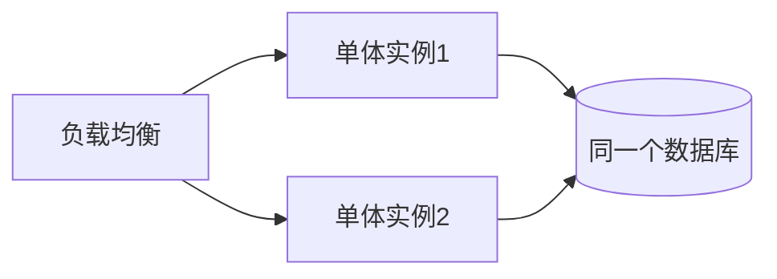
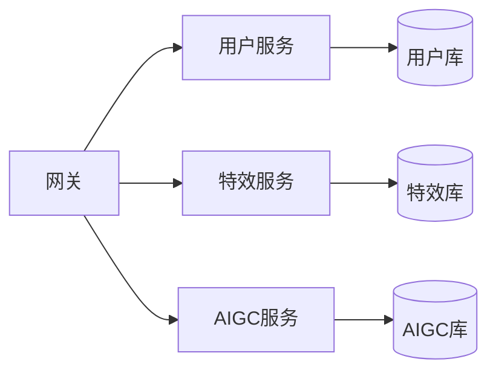

# 服务拆分与架构演进

- 这一篇讲架构是怎么从“一个程序”长成“一堆服务”的，以及最关键的判断：什么时候该拆、拆的代价是什么。
- 核心立场：别盲目追微服务，绝大多数项目从单体起步是对的。

## 单体（Monolith）

- 所有功能（用户、特效、订单、AIGC）打包在一个应用、一个进程里，连一个数据库。

- 优点：
    - 简单：一个仓库、一次部署、本地就能跑全套、调用就是函数调用。
    - 没有网络开销、没有分布式事务、排查直接。
- 缺点（规模大了才显现）：
    - 一处改动要整体重新部署。
    - 模块边界容易腐化、互相耦合。
    - 没法对某个高负载模块单独扩容。
- 重要：单体可以横向扩展（多开实例），单体 ≠ 不能扩容。很多大业务一直是“模块化单体”。

## 微服务（Microservices）

- 按业务边界拆成多个独立服务，各自独立开发、部署、扩容，通常各管各的数据库。

- 优点：
    - 各服务可独立部署、独立扩容（AIGC 吃算力就只扩它）。
    - 团队可并行开发、技术栈可异构（核心 Java、AIGC Python）。
    - 故障隔离（一个服务挂不一定拖垮全部）。
- 代价（很重，常被低估）：
    - 函数调用变网络调用：要处理超时、重试、失败、序列化。
    - 分布式事务难：跨服务的一致性要靠 Saga/最终一致性，比单库事务复杂得多。
    - 运维爆炸：服务发现、配置、监控、链路追踪、部署编排都得有。
    - 本地难跑全套、问题难定位。

## 怎么判断该不该拆

- 别因为“流行”或“显得高级”就拆。拆的正当理由：
    - 不同模块的扩容需求差异很大（AIGC 要 GPU 单独扩，用户服务不用）。
    - 团队大到一个代码库协作困难，需要按团队拆边界。
    - 不同模块发布节奏差异大，互相拖累。
    - 某模块技术栈必须不同（AI 必须 Python）。
- 反向信号（先别拆）：团队小、业务还在快速变、边界没想清楚。这时拆只会自找苦吃。
- 务实路线：先写“模块化单体”——一个部署单元，但内部模块边界清晰、低耦合。等某个模块确实需要独立扩容/发布时，再把它单独拆出去。

## 拆分的依据：业务边界

- 按业务能力（领域）拆，不按技术分层拆。
- 好的边界：用户域、特效域、AIGC 编排域、计费域——每个域内高内聚，域之间低耦合、交互少。
- 坏的拆法：拆成“Controller 服务、Service 服务、DAO 服务”——这只会让每次业务改动横跨所有服务。

## 服务间通信

- 同步：HTTP/JSON 或 gRPC，A 调 B 等结果。简单但有耦合和级联失败风险。
- 异步：通过消息队列发事件，B 自己消费。解耦、抗峰值，但变成最终一致。
- 选型：要立刻拿结果用同步；能容忍延迟、想解耦用异步事件。

## 数据怎么办（最难的部分）

- 微服务原则上各管各的库，别让服务 B 直接读服务 A 的表（否则又耦合回去了）。
- 跨服务要数据：通过对方接口要，或订阅对方事件在本地维护一份副本。
- 跨服务一致性：放弃强事务，用 Saga（把一个大事务拆成多步本地事务 + 失败时的补偿动作）实现最终一致。

## 对你的场景

- 起步建议：核心业务（特效元数据、用户、计费）一个模块化单体（Java）；AIGC 编排因为是 Python、且吃算力波动大，天然适合作为独立服务拆出去。
- 这正好对应你三个场景的物理边界：特效下发服务、AIGC 编排服务、Agent 服务各自独立，之间用 HTTP/队列通信。

## 小结

- 单体简单且能扩容，绝大多数项目应从（模块化）单体起步。
- 微服务换来独立部署/扩容/技术异构，但代价是分布式复杂度，别盲目追。
- 按业务领域边界拆，不按技术分层拆；服务各管各的库。
- 该拆的信号是扩容差异、团队规模、发布节奏、技术栈差异。
