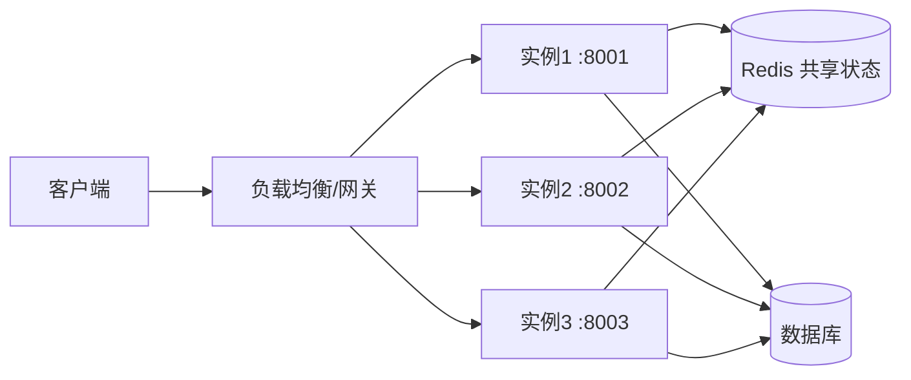
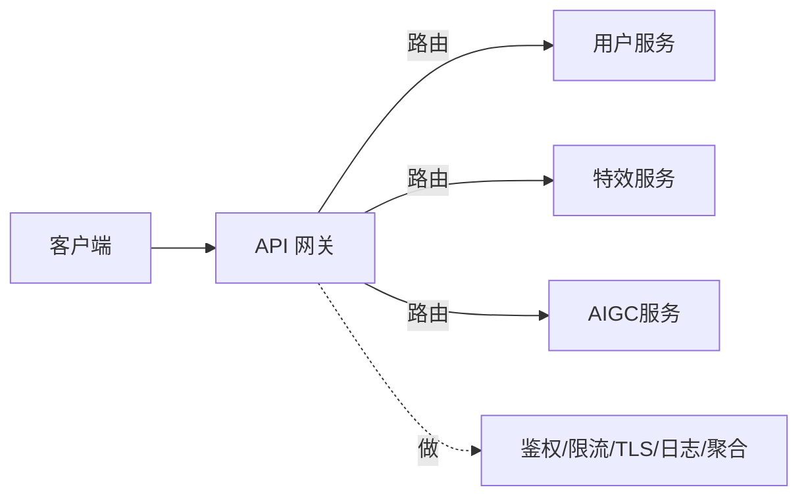
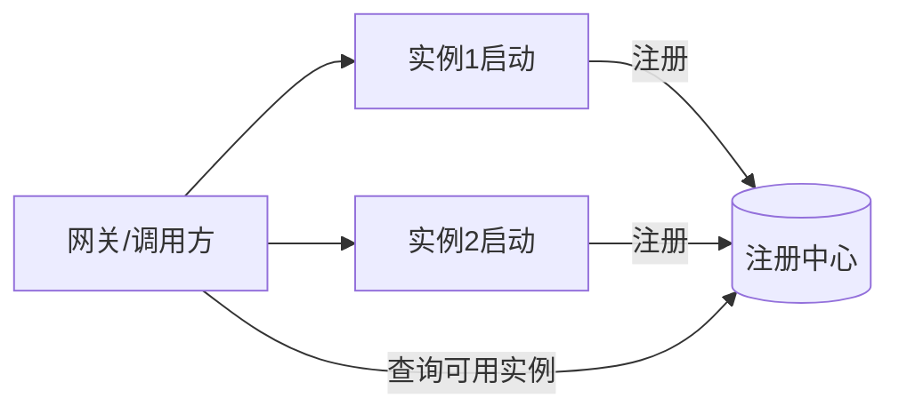

# 集群、负载均衡与网关

- 这一篇回答你最关心的问题：多台服务器组成集群时具体怎么组织？网关怎么开发和运作？
- 配一个可跑的最小集群示例（Nginx 网关 + 多实例 + Redis 共享状态），见 `examples/14-gateway-cluster`。

## 集群：同一份代码开多份

- 集群最基本的形态：把同一个服务部署成 N 个一模一样的实例，前面放一个东西把请求分给它们。



- 为什么这样能行：因为实例是无状态的（第 1 篇的核心结论）。状态都在共享的 Redis/数据库里，所以请求落到哪个实例都一样。
- 收益：扛更高并发（加实例）、高可用（挂一个还有别的）、可滚动升级（逐个替换不停服）。

## 负载均衡：请求怎么分

- 负载均衡器（LB）决定每个请求发给哪个实例。常见策略：
    - 轮询（round robin）：依次分配，最简单。
    - 加权轮询：性能强的实例多分点。
    - 最少连接：分给当前最空闲的。
    - 一致性哈希：按某个 key（如用户 id）固定分到某实例，用于需要“黏性”的场景。
- 健康检查：LB 定期探测每个实例是否健康，把挂掉的摘掉、不再给它发请求，恢复了再加回来。这是高可用的关键。

## 网关：比负载均衡更进一步

- 负载均衡只管“分流量”。网关是“所有请求的统一入口”，在分流量之外还承担一堆横切职责：



- 网关常见职责：
    - 路由：按路径/域名把请求转发到对应后端服务（`/users/*` → 用户服务，`/effects/*` → 特效服务）。
    - 负载均衡：转发时在该服务的多个实例间分流。
    - TLS 终止：在网关统一处理 HTTPS，内部走明文，省去每个服务配证书。
    - 鉴权：在入口统一校验 token，挡掉未授权请求，后端服务不用各自重复做。
    - 限流：保护后端，防止被打爆（见下）。
    - 其他：日志、压缩、跨域、灰度路由、请求聚合。
- 价值：把横切关注点从每个业务服务里抽出来，集中在入口做一次。和 Spring 拦截器思路一样，只是在更外层、对整个集群生效。

## 网关怎么“开发”

- 两条路：
- 用现成网关（绝大多数情况）：
    - Nginx：高性能反向代理，配置文件描述路由和负载均衡（本篇示例用它）。
    - 云厂商 API Gateway、Kong、APISIX、Spring Cloud Gateway：功能更全（鉴权插件、限流、可视化配置）。
- 自己写网关（少数定制需求）：本质是一个反向代理程序——收请求、按规则改写/路由、转发到后端、把响应回传，并在中间插入鉴权/限流等逻辑。Spring Cloud Gateway、自研 Netty 服务都属于这类。

- 一个最简 Nginx 网关配置长这样（示例里有完整版）：

```nginx
# 定义一组后端实例，nginx 会在它们之间做负载均衡
upstream app_backend {
    server app1:8000;
    server app2:8000;
    server app3:8000;
}

server {
    listen 80;
    location /api/ {
        proxy_pass http://app_backend;   # 转发到上面那组实例
        proxy_set_header X-Real-IP $remote_addr;
    }
}
```

## 限流：保护集群不被打爆

- 再多实例也有上限，必须能挡住超额流量（突发、刷接口、下游变慢导致堆积）。
- 常见算法：
    - 固定窗口计数：每秒最多 N 个，简单但窗口边界会突刺。
    - 滑动窗口：更平滑。
    - 令牌桶：以固定速率发令牌，有令牌才放行，允许一定突发。最常用。
- 在哪做：网关层做全局限流（最有效），应用层可做细粒度（按用户/接口）。Redis 常用来做分布式限流计数器（多个网关/实例共享一个计数）。

## 服务发现与配置中心（实例会动态变化）

- 集群里实例会扩容、缩容、重启、迁移，IP 不固定。怎么让网关/调用方知道“现在有哪些实例、在哪”？
- 服务发现：实例启动时把自己注册到注册中心（Consul、Nacos、Eureka、K8s Service），调用方从注册中心查“某服务现在有哪些健康实例”。



- 配置中心：把配置（数据库地址、开关、限流阈值）集中管理，实例启动时拉取、运行时可热更新，不用改代码重新发布。代表：Nacos、Apollo、Consul。

## 会话/状态怎么在集群里共享

- 回到第 1 篇：登录态、任务状态这类“跨请求要记住”的东西，不能放实例内存。
- 放 Redis（或数据库），所有实例共享。这样请求落到任意实例都能读到，实例随便加减都不影响。
- 本篇示例就演示了这一点：三个实例共用一个 Redis 计数器，无论请求被分到哪个实例，计数都连续。

## K8s 在这套体系里是什么

- Kubernetes 把上面这些（多实例、负载均衡、健康检查、服务发现、滚动升级、自动扩缩容）做成了平台能力：
    - Deployment：声明“我要 3 个副本”，它保证维持 3 个、挂了自动拉起。
    - Service：集群内的负载均衡 + 服务发现入口。
    - Ingress：对外的网关/路由。
    - HPA：按 CPU/QPS 自动扩缩容。
- 你不一定要马上学 K8s，但要知道：它是把这一篇的概念产品化的运行平台（部署篇会再提）。

## 小结

- 集群 = 同一份无状态代码开多份，前面用负载均衡/网关分流。
- 负载均衡管分流量 + 健康检查；网关在此之上统一做路由、TLS、鉴权、限流、聚合。
- 网关一般用现成的（Nginx/Kong/云网关），本质是可插逻辑的反向代理。
- 实例动态变化靠服务发现 + 配置中心；共享状态放 Redis。
- 可跑示例见 `examples/14-gateway-cluster`。
