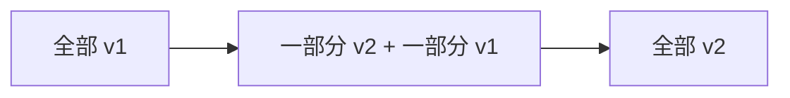

# 容器化与部署发布

- 这一篇回答你 root.md 里的问题：服务端标准的开发、上线、测试、回滚流程是什么。
- 主线：容器化 → CI/CD 流水线 → 发布策略 → 回滚。

## 为什么要容器（Docker）

- 老问题：“在我机器上能跑”——环境（OS、依赖版本、配置）不一致导致到了别的机器就挂。
- 容器把“应用 + 它的运行环境”一起打包成一个镜像（image），到哪都一样地跑。
- 类比：镜像像一个自带完整运行环境的可执行包；容器是这个镜像跑起来的实例。比虚拟机轻得多（共享宿主内核，秒级启动）。

```dockerfile
# 一个 Java 应用的 Dockerfile 示例
FROM eclipse-temurin:21-jre        # 基础镜像：带 JDK21 运行时
WORKDIR /app
COPY build/libs/app.jar app.jar    # 把构建好的 jar 放进镜像
EXPOSE 8080
ENTRYPOINT ["java", "-jar", "app.jar"]   # 容器启动时执行
```

- 镜像构建好后推到镜像仓库（registry），部署时各机器从仓库拉取同一个镜像运行——保证所有实例完全一致。

## CI/CD：从提交代码到上线的流水线

- CI（持续集成）：每次提交代码，自动拉代码、编译、跑测试、构建镜像。目标是尽早发现问题。
- CD（持续交付/部署）：把通过的镜像自动部署到各环境。


- 关键纪律：
    - 测试不过，流水线就卡住，坏代码进不了下一步。
    - 同一个镜像一路从 staging 升到 prod，不重新构建（保证测过的就是上线的）。
    - 部署是自动、可重复的，不靠人手动 SSH 上去改。

## 发布策略：怎么安全地把新版本放上线

- 直接全量替换风险大：新版本有 bug 就全员受影响。所以用渐进式发布。

### 滚动发布（rolling）

- 实例逐批替换：先换 1~2 个实例到新版本，没问题再换下一批，直到全换完。期间新旧版本短暂共存。



- 优点：不停服、资源占用小。是 K8s 默认策略。缺点：新旧共存期要兼容（尤其数据库结构）。

### 蓝绿发布（blue-green）

- 准备两套完整环境：蓝（当前线上）、绿（新版本）。绿验证好后，把流量一次性从蓝切到绿。出问题立刻切回蓝。
- 优点：切换瞬间完成、回滚极快。缺点：要双份资源。

### 金丝雀发布（canary）

- 先把一小撮流量（如 5%）导到新版本，观察指标（错误率、延迟）正常，再逐步加大到 100%。
- 优点：风险最小、能用真实流量验证。最适合重要/高风险变更。

## 功能开关：发布和放量分开

- 发布代码不等于立刻让所有用户用到新功能。
- 功能开关（feature flag）把“代码上线”和“功能开启”拆开：代码先随版本发布，开关控制哪些用户/团队/比例能看到。
- 好处：
    - 新功能出问题时可以先关开关，不一定要回滚整套服务。
    - 可以按内部用户、小流量、全量逐步放量。
    - 对 AI agent 这类能力，可以按团队/频道/用户控制权限和额度。
- 代价：开关也要治理，过期的开关要清理，否则代码路径越来越乱。

## 回滚：出事了怎么快速恢复

- 回滚就是“把线上换回上一个已知正常的版本”。能快速回滚比“追求不出错”更现实。
- 因为镜像是不可变、带版本号的，回滚 = 重新部署上一个版本的镜像，通常一条命令/一键。
- 数据库变更要特别小心：代码能秒回，数据库结构改动（删列、改类型）很难回。所以数据库变更要兼容式、分步做（见下）。
- 上线前就想好回滚预案：怎么回、回到哪个版本、数据怎么办。

## 数据库变更与发布的配合（容易踩坑）

- 滚动/灰度期间新旧代码共存，数据库结构必须同时兼容新旧两版代码。
- 安全做法是分步、向后兼容：
    - 加字段：先加（可空/有默认），新代码开始写，旧代码忽略它——安全。
    - 删字段/改名：分多次发布——先让代码不再用它，确认无引用后，下个版本再删列。绝不要“改代码 + 删列”一把梭。
- 用数据库迁移工具（Flyway、Liquibase、Alembic）把每次结构变更版本化、可追溯、可在流水线里自动执行。

## 部署平台

- 小规模：直接 Docker / docker-compose 跑在几台机器上。
- 规模化：Kubernetes（K8s）——声明“要几个副本、用哪个镜像、怎么滚动升级、何时扩缩容”，它负责维持这个状态。前面网关篇说的多实例、负载均衡、健康检查、滚动升级、自动扩缩容，K8s 都内建。
- 你不必一上来精通 K8s，但要理解：现代部署是“声明期望状态，平台来达成并维持”，而不是手动操作每台机器。

## 健康检查与优雅停机（部署能平滑的前提）

- 健康检查接口：暴露 `/health`（Spring Actuator 自带），让负载均衡/K8s 判断实例是否就绪、是否存活。没就绪不给它发流量。
- 优雅停机：实例下线时，先从负载均衡摘除、停止接新请求、把手头请求处理完再退出，避免请求被硬切断。

## 上线流程串起来

- 提交代码 → CI 自动编译 + 测试 → 构建带版本的镜像推仓库 → 部署 staging 验证 → 金丝雀/滚动发布到 prod → 观察监控指标 → 异常则一键回滚到上一镜像。
- 全程自动、可重复、可回滚，且数据库变更向后兼容。这就是“标准的开发、上线、测试、回滚流程”。
- 上线前至少确认：本次改动影响哪些接口/任务/表结构、怎么观测成功或失败、回滚会不会被数据库变更卡住、是否需要功能开关。

## 小结

- Docker 镜像让“应用+环境”一起打包，到哪都一致；带版本、不可变，是快速回滚的基础。
- CI/CD 把编译、测试、构建、部署自动化；测不过就卡住，同一镜像一路升级。
- 发布用渐进式：滚动/蓝绿/金丝雀，按风险选。
- 功能开关让代码发布和功能放量分开，出问题可先关开关止血。
- 回滚=重部署上一镜像；数据库变更必须分步向后兼容，用迁移工具管理。
- 配健康检查 + 优雅停机，部署才能不掉请求。
