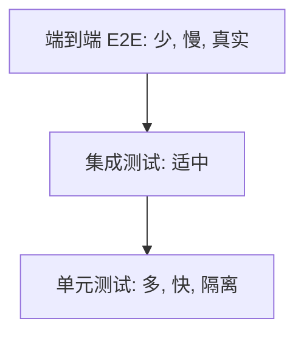

# 测试策略

- 服务端要长期稳定、频繁发布，测试是“敢改、敢上线”的底气。这一篇讲测什么、怎么分层、怎么测依赖。

## 测试金字塔

- 不同层次的测试，数量和成本不同。原则：底层多而快，顶层少而慢。



- 单元测试：测一个类/函数的逻辑，不碰数据库/网络，毫秒级，数量最多。
- 集成测试：测多个组件协作（如 Service + 真实数据库），较慢，数量适中。
- 端到端（E2E）：从接口到数据库整条链路真实跑一遍，最慢最脆，只覆盖关键路径。
- 反模式：只写慢而脆的 E2E，或啥都不测靠手点。

## 单元测试

- 测纯逻辑：给定输入，断言输出/行为。把外部依赖（数据库、下游）用 mock 替换掉，只验证本单元逻辑。

```java
// JUnit 示例：测 Service 的逻辑，Repository 用 mock 顶替
@Test
void getEffect_notFound_throws() {
    EffectRepository repo = mock(EffectRepository.class);
    when(repo.findById(123L)).thenReturn(Optional.empty());  // 假装查不到
    EffectService service = new EffectService(repo);

    assertThrows(NotFoundException.class, () -> service.getById(123L));
}
```

```python
# pytest 示例
def test_get_effect_not_found():
    repo = Mock()
    repo.find.return_value = None
    service = EffectService(repo)
    with pytest.raises(NotFoundError):
        service.get(123)
```

- 这正是分层架构（Service 不依赖 HTTP/具体数据库）带来的好处：业务逻辑能被独立、快速地测。

## mock：替身的几种

- mock 下游的目的：让测试快、可控、可重复，不依赖真实外部系统的状态和可用性。
- stub：返回预设值。mock：还能验证“有没有被调用、调了几次、参数对不对”。
- fake：一个轻量的真实现（如内存版数据库）。
- 注意别过度 mock：把所有东西都 mock 掉，测的可能只是“mock 配置对不对”，没测到真逻辑。

## 集成测试：别用 mock 假装数据库

- 数据库相关逻辑（SQL、事务、迁移）用 mock 测没意义，要对真实数据库测。
- 用 Testcontainers：测试时用 Docker 临时起一个真实的 PostgreSQL/Redis，测完销毁。既真实又干净可重复。
- 这样能抓到 mock 抓不到的问题：SQL 写错、字段类型不匹配、事务行为。

## 契约测试（微服务间）

- 服务 A 调服务 B，B 改了接口可能悄悄把 A 搞挂。
- 契约测试：把“A 期望 B 长什么样”固化成契约，B 的流水线里验证自己没违反契约。
- 在拆了微服务后很重要，否则跨服务接口改动是隐形地雷。

## 测试数据与环境

- 每个测试要自带数据、跑完清理，不依赖“库里恰好有某条数据”，否则测试互相污染、时灵时不灵（flaky）。
- 测试要可重复：同样的代码跑多少遍结果一致。flaky 测试要当 bug 修，不能习惯性重跑。

## 测覆盖什么最值

- 优先测：核心业务逻辑、边界条件、错误/异常分支、幂等性、并发安全的关键路径。
- 别盲目追覆盖率数字：100% 覆盖率不等于没 bug，关键路径测扎实比数字好看重要。

## 在流水线里的位置

- CI 里：提交即跑单元 + 集成测试，不过就拦住，不让合并/上线（呼应部署篇）。
- 测试是自动化质量门，不是上线前手工跑一遍的可选项。

## 性能/压力测试（按需）

- 上线前对关键接口做压测，确认目标并发下的吞吐和延迟达标、不崩。
- 工具：k6、JMeter、Locust。关注吞吐（QPS）、延迟分布（尤其 p99 尾延迟）、错误率、资源占用。

## 小结

- 测试金字塔：单元多而快、集成适中、E2E 少而精。
- 单元测试 mock 掉外部依赖，专测逻辑；分层架构让逻辑可独立测。
- 数据库/Redis 用 Testcontainers 对真实依赖做集成测试，别用 mock 假装。
- 微服务间用契约测试防接口破坏；测试要自带数据、可重复、进 CI 当质量门。
