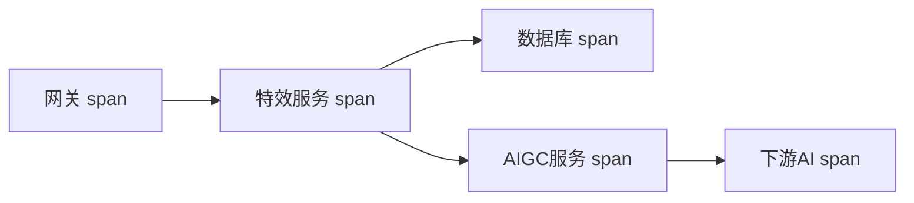

# 可观测性与线上排障

- 服务上线后跑在远端、还是集群，你看不到它内部。可观测性就是“给系统装上仪表盘和黑匣子”，让你知道它健不健康、出事时能定位。
- 三大支柱：日志（Logs）、指标（Metrics）、链路追踪（Tracing）。

## 为什么 native 调试经验不够用

- 本地能断点、能看内存。线上是多实例、远端、并发、长期运行——不能断点，只能靠它“主动吐出”的信息来推断发生了什么。
- 所以代码要在关键处主动记录信息，事后才有据可查。出事时没埋点 = 抓瞎。

## 日志（Logs）：发生了什么

- 记录离散事件：请求进来了、调用了某下游、出了某异常。
- 要点：
    - 用日志级别：DEBUG（调试细节）、INFO（正常关键节点）、WARN（异常但可恢复）、ERROR（出错需关注）。线上一般开 INFO 以上。
    - 结构化日志：输出 JSON 而非纯文本，便于机器检索（按字段过滤）。
    - 每条日志带 traceId：把一次请求经过的所有日志串起来（见下）。
    - 别记敏感信息（密码、token、身份证），别在循环里狂打日志拖垮性能。

```java
// 结构化日志带上下文：出事时按 traceId 能捞出这次请求的全部日志
log.info("create effect, name={}, userId={}, traceId={}", name, userId, traceId);
```

- 集中收集：多实例的日志要汇聚到一处（ELK/Loki/云日志服务）统一检索，不能登录每台机器翻文件。

## 指标（Metrics）：现在状态如何

- 数值型的、可聚合的趋势数据，用来看健康度和趋势、配告警。
- 关键指标（黄金信号）：
    - 流量：QPS（每秒请求数）。
    - 错误率：5xx 比例。
    - 延迟：响应时间，重点看 p95/p99 尾延迟（平均值会骗人）。
    - 饱和度：CPU、内存、连接池、队列积压。
- 工具：应用用 Prometheus 暴露指标（Spring Actuator + Micrometer 自带），Grafana 画仪表盘，超阈值触发告警。

```text
http_requests_total{path="/v1/effects", status="200"}  12345
http_request_duration_seconds{path="/v1/effects", quantile="0.99"}  0.85
```

## 链路追踪（Tracing）：一次请求走了哪些环节、各花多久

- 微服务/编排场景里，一次请求跨多个服务，慢在哪、错在哪很难找。链路追踪给请求一个 traceId，沿途每个服务/每个下游调用记一个 span，串成一条完整调用链。



- 价值：一眼看出“这次请求总耗时 3s，其中 2.8s 花在某个下游 AI 调用”——直接定位瓶颈。这正好接上编排篇说的“单步耗时统计”。
- traceId 贯穿日志、追踪：拿到一个出错请求的 traceId，既能看它的调用链，又能捞它的全部日志。工具：OpenTelemetry（标准）、Jaeger、Zipkin、云 APM。

## 三者怎么配合排障


- 指标告诉你“出事了、大概在哪”，追踪告诉你“具体卡在哪一环”，日志告诉你“那一环到底报了什么”。三者缺一不可。

## 告警

- 对关键指标设阈值告警（错误率、延迟、积压、实例存活），异常时主动通知（而不是等用户投诉）。
- 告警要可执行、别太吵：告警太多会让人麻木（告警疲劳），只对“需要人介入”的事告警。
- 配套：on-call 值班、故障分级、事后复盘（postmortem）。

## 健康检查

- 暴露 `/health`（存活）和 `/ready`（就绪）接口，给负载均衡/K8s 判断要不要给它发流量、要不要重启它（呼应部署篇）。

## 容量与性能意识

- 知道单实例能扛多少 QPS、瓶颈在哪（CPU？数据库？下游？），才知道何时该扩容。
- 压测（见测试篇）+ 线上指标共同回答“现在还能扛多少、要不要加机器”。

## 最小排障 Runbook

- 先看影响面：是所有接口都慢，还是某个接口/某个租户/某个下游相关请求慢。
- 看指标：错误率、p99 延迟、QPS、CPU/内存、连接池、队列积压有没有同时变化。
- 看 tracing：抽一条慢请求，确认时间花在网关、应用、数据库、缓存，还是某个下游 AI 服务。
- 看日志：用 traceId 搜关键错误，确认异常类型、请求参数摘要、下游返回码。
- 止血优先：限流、降级、关功能开关、扩容、回滚。根因分析可以在服务恢复后慢慢做。
- 复盘要沉淀：补监控、补告警、补测试、补 runbook，而不是只修当次 bug。

## 小结

- 线上靠可观测性而非断点：日志（发生了什么）、指标（状态如何）、追踪（走了哪、各多久）。
- 日志结构化、分级、带 traceId、集中收集；指标盯流量/错误率/延迟p99/饱和度。
- 链路追踪用 traceId 串起跨服务调用，定位瓶颈和错误环节。
- 排障路径：指标告警 → 追踪定位环节 → 日志看细节；先止血，再复盘补系统能力。
