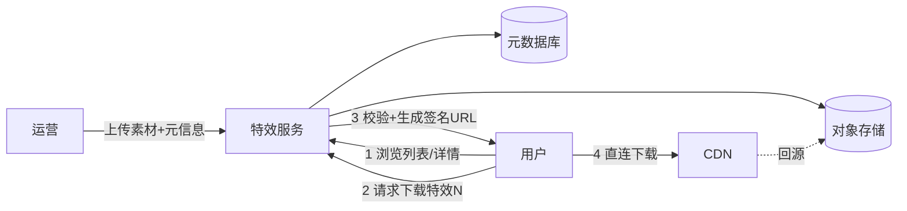
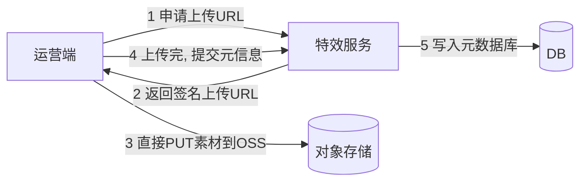

# 实战 A：短视频特效云端存储与下发

- 目标：做一个服务，管理一批预制特效（转场等），用户选用某特效时，把它下发到本地设备。
- 这是把前面的对象存储、CDN、签名 URL、数据库、鉴权、API 设计串起来的综合应用。
- 配可运行的最小示例（FastAPI + MinIO 本地对象存储）见 `examples/20-effect-delivery`。

## 需求拆解

- 运营侧：上传特效素材、填写元信息（名称、分类、封面、版本）。
- 用户侧：浏览/搜索特效列表、查看详情、下载选中的特效到本地。
- 非功能：海量用户重复下载要快要省、要能控制谁能下、素材更新不串味。

## 架构



- 职责分工（呼应对象存储篇）：
    - 元数据库：特效的 id、名称、分类、版本、大小、对象存储 key。
    - 对象存储：真正的素材二进制（带版本的 key，如 `effects/123/v2/transition.zip`）。
    - CDN：缓存素材就近下发。
    - 特效服务：管理元数据、鉴权、发签名 URL，不当文件中转。

## 数据模型

```sql
CREATE TABLE effects (
    id          BIGSERIAL PRIMARY KEY,
    name        VARCHAR(100) NOT NULL,
    category    VARCHAR(50)  NOT NULL,
    version     INT          NOT NULL DEFAULT 1,
    object_key  VARCHAR(255) NOT NULL,   -- 在对象存储里的 key（带版本）
    size_bytes  BIGINT       NOT NULL,
    sha256      CHAR(64)     NOT NULL,   -- 客户端下载后可校验完整性
    platform    VARCHAR(20)  NOT NULL,   -- ios/android/windows/mac/all
    min_engine_version VARCHAR(30),       -- 最低特效引擎版本，避免老客户端下载不能用的素材
    status      VARCHAR(20)  NOT NULL DEFAULT 'published', -- draft/published/archived
    created_at  TIMESTAMPTZ  NOT NULL DEFAULT now()
);
CREATE INDEX idx_effects_category ON effects(category, created_at DESC);
```

- 真实项目常会把“一个特效”拆成两层：
    - `effects`：业务概念，如名称、分类、封面、状态。
    - `effect_versions`：每个版本的包体、hash、大小、平台、引擎兼容范围、发布时间。
- 好处：同一个特效可以同时保留多个版本，老客户端继续拿老版本，新客户端拿新版本。

## 关键接口

```text
GET  /v1/effects?category=transition&cursor=...   列表(游标分页)
GET  /v1/effects/{id}                              详情
POST /v1/effects:upload-url                        运营: 拿上传签名URL
POST /v1/effects                                   运营: 提交元信息(素材已上传)
GET  /v1/effects/{id}/download-url                 用户: 拿下载签名URL
```

## 上传流程（运营侧，分两步）

- 不让素材经过应用服务器，先拿上传签名 URL 直传对象存储，再回填元信息。



- 大素材用分片上传（数据传输篇）。

## 下载流程（用户侧，核心）

```python
@app.get("/v1/effects/{id}/download-url")
def get_download_url(id: int, user = Depends(get_current_user)):
    effect = repo.find(id)
    if effect is None or effect.status != "published":
        raise HTTPException(404)
    # 鉴权/付费校验就在这一步做：决定要不要发链接
    if not can_access(user, effect):
        raise HTTPException(403)
    # 生成带时效的签名URL，客户端拿它直连 CDN/OSS 下载，不经过本服务
    url = storage.presigned_get(effect.object_key, expires=300)
    return {"url": url, "expiresIn": 300}
```

- 要点回顾：
    - 鉴权在“发链接”这一步做，链接本身有时效。
    - 流量走 CDN，不压应用。
    - 下载支持断点续传（Range），由 CDN/对象存储原生提供。

## 缓存与更新策略

- 列表/详情这类高频读，用 Redis 缓存（NoSQL/缓存篇），设 TTL + 更新时删缓存。
- 素材更新：版本号 +1、用新的 object_key（`.../v3/...`），URL 随之变化，天然绕开 CDN 旧缓存——不需要手动刷 CDN。
- 旧版本素材可保留一段时间（老客户端还在用），再按生命周期归档/清理。

## 发布治理

- 上传完成后不要立刻发布，先进入 `draft` 或 `reviewing` 状态，完成以下校验再切到 `published`。
- 校验清单：
    - 文件大小、content-type、sha256 和运营提交的元信息一致。
    - 包体能被目标版本的特效引擎加载，平台字段正确。
    - 封面/预览图存在，列表页不会出现残缺素材。
    - 灰度发布时，只让内部用户或少量版本客户端看到新素材。
- 发布不是覆盖原文件，而是写新 `object_key` + 新版本记录；回滚就是把当前生效版本指回旧版本。

## 可靠性与扩展

- 特效服务无状态，可多实例 + 网关（集群篇），状态在 DB/Redis/OSS。
- 下载量大不影响应用（流量在 CDN），应用只扛“发链接”的轻量请求。
- 监控：下载 URL 签发量、缓存命中率、CDN 命中率、对象存储错误、按版本下载量、客户端校验失败率（可观测篇）。

## 这个实战用到的前面知识

- API 设计（03）：资源命名、游标分页、状态码。
- 数据传输与大文件（04）：分片上传、签名 URL、Range 断点续传。
- 对象存储与 CDN（11）：元数据/文件分工、CDN 下发、版本化文件名。
- 缓存（10）：列表详情缓存。
- 鉴权（15）：发链接前的权限校验。
- 集群（14）/部署（17）/可观测（19）：上线运维。

## 小结

- 核心套路：元数据进库、素材进对象存储、下发走 CDN、应用只发带时效的签名 URL 并在此鉴权。
- 版本化 object_key 解决素材更新与缓存一致性。
- 生产里还要管平台/引擎兼容、hash 校验、灰度发布和版本回滚。
- 应用保持无状态、轻量，下载流量交给 CDN 扛。
- 可运行示例见 `examples/20-effect-delivery`。
