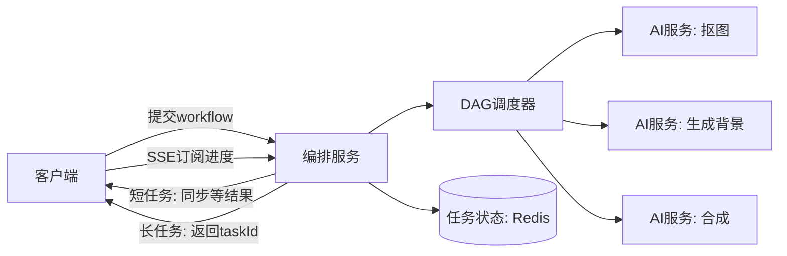
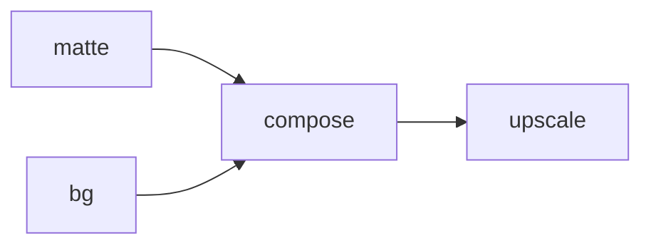
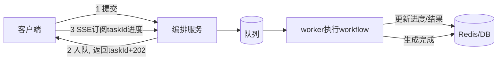

# 实战 B：AIGC Workflow 编排服务

- 目标：用服务端代码把多个 AIGC service 串起来，支持分支执行、耗时统计、同步 & 异步生成。
- 这是把编排篇、并发篇、消息队列篇、可观测篇落到一个真实服务里。
- 配可运行示例（FastAPI + asyncio DAG 调度 + SSE 进度）见 `examples/21-aigc-workflow`。

## 需求拆解

- 一个生成任务由多个步骤组成（抠图、生成背景、合成、超分），步骤间有依赖（DAG）。
- 步骤分别调用不同的下游 AI service（HTTP），每个都可能慢、可能失败。
- 要支持：无依赖步骤并行、按结果分支、单步和总耗时统计、短任务同步返回、长任务异步 + 进度推送。

## 整体架构



## 工作流定义（DAG）

- 把工作流描述成节点 + 依赖，调度器据此决定执行顺序和并行度。

```python
# 每个节点声明: 名字、依赖哪些节点、执行函数
workflow = {
    "matte":   Node(deps=[],                  run=call_matting),     # 抠图
    "bg":      Node(deps=[],                  run=call_gen_bg),      # 生成背景(和抠图并行)
    "compose": Node(deps=["matte", "bg"],     run=call_compose),     # 依赖前两个
    "upscale": Node(deps=["compose"],         run=call_upscale),     # 超分
}
```



## 调度器核心逻辑

- 反复找“依赖都完成”的节点并发执行，直到全部完成（呼应编排篇的 DAG 调度）。

```python
async def run_workflow(nodes):
    done = {}                      # 节点名 -> 结果
    pending = set(nodes)
    while pending:
        # 找出依赖都已完成、可以跑的节点
        ready = [n for n in pending if all(d in done for d in nodes[n].deps)]
        # 并发执行这一批(无依赖关系的节点并行)，每个都带超时和重试
        results = await asyncio.gather(*[
            run_node(nodes[n], done) for n in ready
        ])
        for n, res in zip(ready, results):
            done[n] = res
            pending.discard(n)
    return done
```

## 每个节点要包好的能力（编排篇的纪律）

```python
async def run_node(node, ctx):
    start = time.monotonic()
    try:
        # 超时 + 重试退避，调用下游 AI service
        result = await with_retry(
            lambda: asyncio.wait_for(node.run(ctx), timeout=node.timeout)
        )
        return result
    finally:
        # 单步耗时统计，进度推送 + 进监控
        elapsed = time.monotonic() - start
        publish_progress(node.name, elapsed)
```

- 必备：单步超时、可重试（且下游需幂等/带幂等键）、并发数限制（信号量，别同时打爆下游）、单步耗时打点。

## 分支执行

- 按上一步结果决定走哪条分支：调度时动态判断节点是否要执行。

```python
# 例: 检测到人像才走美颜分支，否则跳过
if ctx["matte"].has_person:
    enable("beautify")
else:
    skip("beautify")
```

## 同步 vs 异步（并发篇 + 编排篇）

- 短任务（几秒）：HTTP 里同步等 `run_workflow` 完成直接返回结果。
- 长任务（几十秒+）：



- 用 202 + taskId，重活交 worker（消息队列篇），客户端用 SSE 看进度（网络协议篇）。

## 进度推送（SSE）

```python
@app.get("/v1/tasks/{task_id}/events")
async def task_events(task_id: str):
    async def gen():
        # 持续从Redis读该任务进度, 有更新就推一条事件
        async for update in subscribe_progress(task_id):
            yield f"data: {json.dumps(update)}\n\n"
    return StreamingResponse(gen(), media_type="text/event-stream")
```

## 状态管理（无状态 + 状态外置）

- 编排服务本身无状态，可多实例。任务状态（进度、各步结果、最终产物地址）存 Redis/DB，任意实例都能读、能续。
- 产物（生成的图/视频）存对象存储，返回签名 URL（复用实战 A 的下发套路）。
- 任务最好有明确状态机，而不是随便写字符串：

```text
pending -> running -> succeeded
                  \-> failed
                  \-> canceled
```

- 每次状态变化都记录时间、错误码、当前节点，方便恢复和排障。
- 提交任务要支持幂等键：客户端重试同一个生成请求时，返回同一个 `taskId`，不要重复烧算力。
- 取消任务要分两层：
    - 业务状态标成 `canceling/canceled`，客户端立即知道“已请求取消”。
    - worker 在节点边界检查取消标记，能停就停；已经发给下游 AI 的请求不一定能真正撤回，要能接受最终一致。
- 恢复任务的底线：worker 崩溃后，系统能根据 DB/Redis 里的节点状态判断哪些节点完成、哪些要重试。

## 可观测（可观测篇）

- 每个任务、每个节点带 traceId 和 span，能看到一次编排里每个 AI 调用各花多久、谁失败。
- 指标：任务量、成功率、取消率、各节点 p99 耗时、队列积压、下游错误率、重试次数、单任务成本。

## 选型提醒

- 这个示例是“进程内轻量编排”，适合一次能跑完、状态简单的场景。
- 如果工作流要长时间运行、跨重启可靠恢复、可视化和审计，上专门的工作流引擎（Temporal/Argo），别自己硬扛持久化（编排篇结尾）。

## 这个实战用到的前面知识

- 并发模型（07）：async 并发推进大量等待型下游调用。
- 编排与任务流（08）：DAG 调度、超时/重试/并发限制、同步转异步。
- 消息队列（12）：长任务交后台 worker、削峰。
- 网络协议（02）：SSE 推进度。
- 对象存储/CDN（11）：产物下发。
- 可观测（19）：链路追踪与单步耗时。

## 小结

- 把工作流建成 DAG，调度器并发跑“依赖已满足”的节点；每个节点包好超时/重试/并发限制/耗时打点。
- 短任务同步返回，长任务用 202+taskId+SSE，重活交 worker。
- 服务无状态、状态进 Redis/DB、产物进对象存储；任务要有状态机、幂等提交、取消和恢复策略。
- 复杂持久工作流改用专门引擎。
- 可运行示例见 `examples/21-aigc-workflow`。
