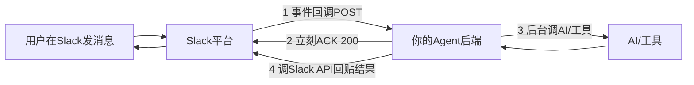
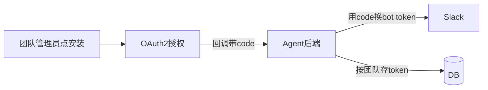
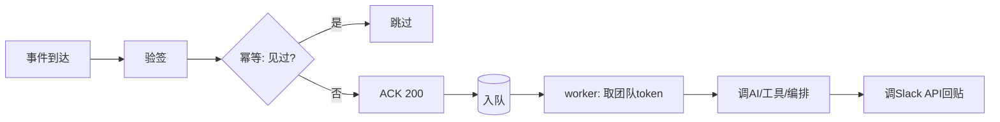

# 实战 C：团队向 AI Agent 后端（Slack app）

- 目标：做一个 Slack app 的后端，开放给研发团队用——在 Slack 里 @机器人 或发命令，后端调 AI/工具处理，把结果回贴到 Slack。
- 这是把鉴权（OAuth2）、异步任务、回调、状态管理综合到一个对外集成场景。
- 配可运行示例（FastAPI + Slack 事件回调骨架）见 `examples/22-slack-agent`。

## Slack app 的交互模型

- Slack 作为“客户端”，通过 Webhook（事件回调）把用户消息推给你的后端；你的后端处理后用 Slack Web API 把回复发回去。



- 这里有两个外部约束决定了架构，下面分别说。

## 约束一：必须 3 秒内 ACK → 长任务必须异步

- Slack 要求事件回调在 ~3 秒内返回 200，否则判超时并重试。
- 但 AI 处理往往要几秒到几十秒。所以必须：收到事件先立刻 ACK，把活丢到后台异步做，做完再用 Slack API 主动回贴。

```python
@app.post("/slack/events")
async def slack_events(req: Request, background: BackgroundTasks):
    body = await req.json()
    # Slack 首次配置会发 url_verification, 原样回 challenge
    if body.get("type") == "url_verification":
        return {"challenge": body["challenge"]}

    # 关键: 不在这里等AI处理。丢到后台, 立刻返回, 满足3秒ACK
    background.add_task(handle_event, body)
    return {"ok": True}        # 立刻 ACK
```

- 生产里 `BackgroundTasks` 不够（进程重启会丢、不能跨实例），应改用消息队列 + worker（消息队列篇），保证可靠和可扩展。

## 约束二：Slack 会重复投递 → 必须幂等

- 超时/网络问题下 Slack 会重发同一事件。处理必须幂等，否则机器人会重复回复、重复执行。
- 用事件自带的去重 id（如 `event_id`）做幂等：处理前记下、见过就跳过（呼应 API 设计篇幂等、消息队列篇幂等消费）。

```python
async def handle_event(body):
    event_id = body["event_id"]
    # SET NX: 第一次设成功才处理, 重复投递会失败 -> 直接跳过
    if not await redis.set(f"slack:evt:{event_id}", "1", nx=True, ex=3600):
        return
    ...  # 真正处理
```

## 鉴权两个方向（鉴权篇）

- 验入站（Slack → 你）：校验 Slack 的请求签名（用 signing secret 验 `X-Slack-Signature`），确认请求确实来自 Slack、没被伪造。
- 验签还要校验 `X-Slack-Request-Timestamp`，拒绝太旧的请求，防止别人把一条旧请求原封不动重放。
- 你访问 Slack（你 → Slack）：通过 OAuth2 安装流程拿到该工作区的 bot token，调 Slack Web API 时带上。token 按工作区存好（每个安装你 app 的团队一份）。
- 示例代码为了本地 curl 方便，没带签名头时会放行；生产环境必须改成“没签名直接拒绝”。



## 处理一条消息的完整流程



- worker 里可以复用实战 B 的编排能力（调多个 AI/工具、超时重试），结果通过 Slack API（`chat.postMessage`）回贴到原频道/线程。

## 状态管理

- 会话上下文（多轮对话、某次任务进度）存 Redis/DB，不放实例内存——多实例 + worker 都要能读（无状态原则）。
- 长任务可先回一条“处理中…”消息占位，完成后更新这条消息（Slack 支持 `chat.update`），体验更好。

## 安全与治理（对内工具也要管）

- 验签必做，否则任何人都能伪造事件触发你的后端。
- 按团队/用户限流，防止刷爆 AI 额度（网关/应用限流，可观测篇监控用量）。
- 权限：哪些频道/用户能用哪些命令；危险操作要二次确认。
- token、signing secret 走密钥管理，不入库（配置篇）。
- 审计：谁在什么时候让 agent 做了什么，记日志（可观测篇）。
- Slack Web API 有限速，收到 429 要按 `Retry-After` 退避重试，不能立刻狂重试。
- 不要把用户原文、token、内部代码片段无脑打到日志里；日志要能排障，也要能过安全审查。

## 部署形态

- 一个无状态的 web 服务（收事件、ACK、入队）+ 一组 worker（干活、回贴）+ Redis（幂等/状态/队列）+ DB（团队 token、审计）。
- web 和 worker 各自多实例、独立扩容（集群篇、部署篇）。Slack 回调地址必须是公网 HTTPS。

## 这个实战用到的前面知识

- 网络协议（02）：Webhook/HTTP 回调。
- API 设计（03）：幂等、快速 ACK、202 思路。
- 编排（08）/并发（07）：worker 里调 AI/工具。
- 消息队列（12）：可靠异步、幂等消费、扩容 worker。
- 鉴权（15）：Slack 验签 + OAuth2 拿 token。
- 缓存（10）：幂等去重、会话状态。
- 集群/部署/可观测（14/17/19）：上线运维与用量监控。

## 小结

- 外部集成的两条铁律：3 秒内 ACK（长任务必须异步 + worker），以及重复投递必须幂等。
- 鉴权两个方向：验 Slack 入站签名和 timestamp 防重放 + 用 OAuth2 token 调 Slack。
- 会话/任务状态外置到 Redis/DB，web 与 worker 都无状态可扩容。
- 对内工具同样要验签、限流、权限、审计。
- 可运行示例见 `examples/22-slack-agent`。
