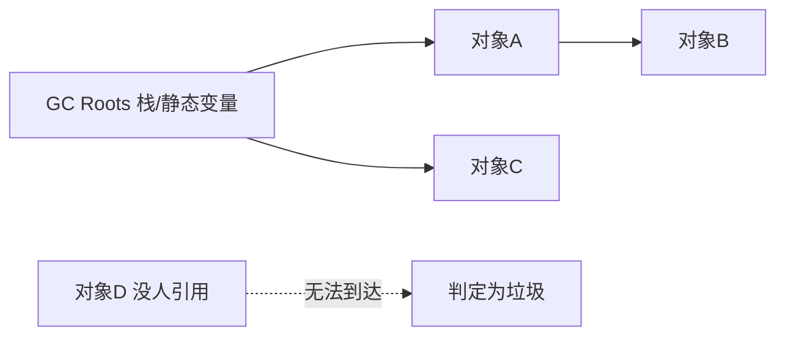

# Java 内存与 GC

- 这是从 C++ 转 Java 心智差异最大的一块：Java 没有 `delete`，对象的回收由垃圾回收器（GC）自动完成。
- 理解内存模型能帮你避开内存泄漏、看懂性能问题。

## 内存大致分区

- `栈 (Stack)`：每个线程一个，存放方法调用帧、局部变量、基本类型的值、对象的引用（不是对象本身）。方法结束自动弹出。
- `堆 (Heap)`：所有线程共享，所有 `new` 出来的对象都在这里。GC 主要管的就是堆。
- 类比 C++：栈的概念一样；区别在于 C++ 对象可以直接放栈上（值语义、RAII），Java 从语言模型上看对象都通过引用访问，`new` 出来的对象由堆和 GC 管理。JIT 可能用逃逸分析做栈上分配/标量替换优化，但那是 JVM 优化细节，不是你能依赖的语义。

```java
void demo() {
    int x = 10;              // x 在栈上（基本类型，存值）
    User u = new User();     // u 这个引用在栈上，User 对象在堆上
}                            // 方法结束，x 和引用 u 消失；堆上 User 对象等 GC 回收
```

## GC 的基本思路

- 核心问题：哪些对象还“有用”？答案：能从“根”引用到的对象就是活的，否则就是垃圾。
- `根 (GC Roots)`：栈上的局部变量引用、静态字段等。
- GC 从根出发顺着引用走，标记所有可达对象；剩下不可达的就是垃圾，可以回收。这叫“可达性分析”。



- 和 C++ 智能指针的对比：`shared_ptr` 用引用计数，循环引用会泄漏；Java 用可达性分析，能正确回收循环引用的对象。

## 分代回收

- 主流 GC 基于“分代假说”：大部分对象很快就没用（朝生夕死）。于是把堆分成：
- `新生代 (Young)`：新对象先放这里，回收频繁、速度快（Minor GC）。
- `老年代 (Old)`：多次回收后还活着的对象晋升到这里，回收较少但较慢（Major / Full GC）。
- 好处：大多数垃圾在新生代就被快速清掉，不用每次扫整个堆。

## STW：Stop The World

- GC 在某些阶段需要暂停所有应用线程，叫 Stop-The-World。暂停太久会造成服务“卡顿”。
- 现代 GC（如 G1、ZGC）的主要目标就是把 STW 时间压到很短（毫秒甚至亚毫秒级）。
- 后端调优常关注：GC 频率、每次暂停时长、吞吐量。

## 这就完全不用操心内存了吗

- 不是。GC 管的是“没人引用的对象”，如果你不小心一直持有引用，对象就永远不会被回收 —— 这就是 Java 的内存泄漏。
- 常见泄漏来源：
- 静态集合越加越多（如全局 `static Map` 一直 put 不 remove）。
- 监听器/回调注册了不注销。
- 缓存没有淘汰策略，无限增长。

## 回收时机不确定

- C++ 的析构函数在作用域结束时确定执行；Java 的 GC 什么时候回收对象不确定。
- 不要用 `finalize()` 做资源清理，它已经是过时机制，也不可靠。
- 文件、数据库连接、Socket、锁这类资源要显式关闭或释放，常用 `try-with-resources`。

## 你需要做和不需要做的

- 不需要：手动 `delete`、配对 new/delete、写析构函数管理内存。
- 需要：
- 用完即弃，别用静态变量长期持有大对象。
- 资源类（文件、连接、Socket）仍要显式关闭，用 try-with-resources（见[异常处理](异常处理.md)）。GC 只管内存，不管这些操作系统资源。
- 关注是否有“该释放却被引用”的对象。

## 和 C++ 的对照总结

- C++：谁分配谁释放，RAII + 智能指针把释放绑定到作用域，可控但易出错（泄漏、悬垂指针、double free）。
- Java：分配自由、释放自动，省心且安全，但失去了精确控制时机，且对“资源类”仍需手动关闭。
- 一句话：Java 把“内存安全”交给了 JVM，代价是你对回收时机的控制权，换来的是开发效率和更少的内存类 bug。
