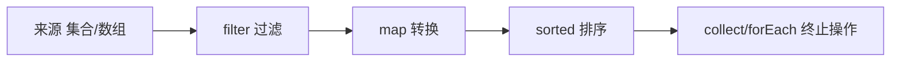

# Java 函数式与 Stream

- Java 8 引入了 Lambda 和 Stream，让你能用更声明式的方式处理数据，代码更短更清晰。
- 你如果用过 C++ 的 lambda 和 ranges、或者 JS 的数组方法，会很熟悉这套思路。

## Lambda 表达式

- Lambda 就是“一段可以传递的匿名函数”，语法 `(参数) -> 表达式或代码块`。

```java
// 完整写法：Runnable 是一个无参无返回的函数接口
Runnable r = () -> System.out.println("hi");

// 带参数：把两个 int 相加
java.util.function.BinaryOperator<Integer> add = (a, b) -> a + b;
int sum = add.apply(2, 3); // 5
```

- 对比 C++ lambda：Java 的 lambda 没有捕获列表 `[]`，它自动捕获用到的外部变量，但要求这些变量是“事实上不可变”的（捕获后不能再改）。

## 函数式接口

- Lambda 的本质是“实现一个只有单个抽象方法的接口”，这种接口叫函数式接口。
- 常用内置函数式接口（在 `java.util.function`）：
- `Supplier<T>`：无参，返回一个 T（生产者）。
- `Consumer<T>`：接收一个 T，无返回（消费者）。
- `Function<T,R>`：接收 T，返回 R（转换）。
- `Predicate<T>`：接收 T，返回 boolean（判断）。

```java
import java.util.function.Predicate;
Predicate<Integer> isEven = n -> n % 2 == 0;
boolean b = isEven.test(4); // true
```

## 方法引用

- 当 lambda 只是“调用一个已有方法”时，可以用 `::` 简写，更易读。

```java
// 下面两行等价
java.util.function.Consumer<String> p1 = s -> System.out.println(s);
java.util.function.Consumer<String> p2 = System.out::println; // 方法引用
```

## Stream：流式数据处理

- Stream 把“对集合的一连串操作”串成流水线，写起来像声明式查询，而不是手写 for 循环。
- 一条流水线分三段：来源 → 中间操作（可链多个，惰性）→ 终止操作（触发执行，产出结果）。



```java
import java.util.List;
import java.util.stream.Collectors;

List<String> names = List.of("Alice", "Bob", "Carol", "Dan");

// 需求：挑出长度>3的名字，转大写，收集成新列表
List<String> result = names.stream()      // 1. 来源：从集合得到流
    .filter(name -> name.length() > 3)     // 2. 中间操作：过滤
    .map(String::toUpperCase)              // 3. 中间操作：转换
    .sorted()                              // 4. 中间操作：排序
    .collect(Collectors.toList());         // 5. 终止操作：收集成 List
// result = [ALICE, CAROL]
```

## 常用操作速查

- `filter(predicate)`：保留满足条件的元素。
- `map(function)`：把每个元素转换成另一种。
- `sorted()` / `sorted(comparator)`：排序。
- `distinct()`：去重。
- `limit(n)` / `skip(n)`：截取。
- `count()`：计数（终止）。
- `forEach(consumer)`：逐个消费（终止）。
- `collect(...)`：收集成 List / Set / Map（终止）。
- `reduce(...)`：聚合成单个值，如求和（终止）。
- `anyMatch / allMatch`：判断是否存在/全部满足（终止）。

## 一个聚合例子

```java
import java.util.List;

List<Integer> nums = List.of(1, 2, 3, 4, 5);

// 求所有偶数的平方和
int total = nums.stream()
    .filter(n -> n % 2 == 0)   // 2, 4
    .map(n -> n * n)            // 4, 16
    .reduce(0, Integer::sum);  // 从 0 开始累加 -> 20
```

## 惰性求值

- 中间操作（filter、map 等）是“惰性”的：它们只是搭好流水线，不会立刻执行。
- 只有遇到终止操作（collect、forEach、count 等）才真正开始处理数据，并且是“一个元素走完整条流水线再处理下一个”，效率高。

## 实践建议

- Stream 适合“数据变换与查询”，让逻辑一眼能读懂；但调试时不如普通循环直观。
- 简单遍历用 for-each 就好，没必要硬上 Stream。
- 尽量让 Stream 操作保持无副作用：不要在 `map/filter` 里修改外部集合或共享变量，尤其不要和 `parallelStream()` 混在一起。
- 大数据量、CPU 密集且元素独立时，可以用 `parallelStream()` 并行处理，但要注意线程安全和开销，别滥用。

## 可运行示例

- 代码：[`examples/stream/StreamDemo.java`](examples/stream/StreamDemo.java)
- 演示 Lambda、方法引用、过滤/转换/排序/聚合/分组，以及惰性求值。
- 运行：

```bash
cd Java/examples/stream
java StreamDemo.java
```
