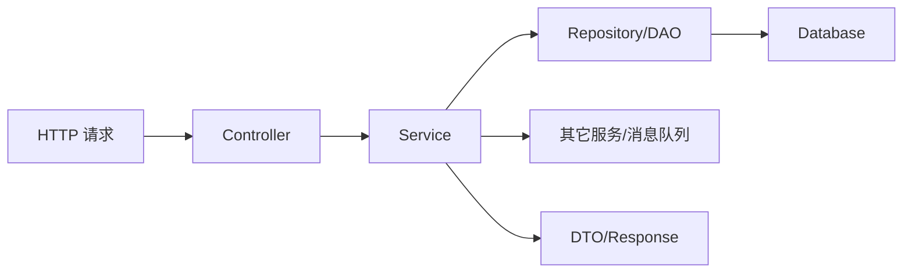

# Java 后端开发入口

- 这个教程主要学 Java 语言本身；真正写后端时，还要把语言知识接到 HTTP、JSON、数据库、配置和部署上。
- 这一篇只做地图，不展开成完整后端教程。

## 一次请求大概怎么走



- `Controller`：把 HTTP 请求转成 Java 方法调用，做参数接收和响应返回。
- `Service`：放业务逻辑，应该尽量和 HTTP 框架解耦。
- `Repository / DAO`：负责读写数据库。
- `DTO`：接口层输入输出的数据结构，常用 `record` 或普通 class。

## Spring Boot 是主入口

- Java 后端最常见入口是 Spring Boot。
- 它帮你处理 HTTP 服务、依赖注入、配置、JSON、数据库连接、测试等工程问题。
- 你现在学的 class、接口、泛型、异常、集合、注解、构建工具，都会在 Spring 项目里直接用到。

```java
import org.springframework.web.bind.annotation.GetMapping;
import org.springframework.web.bind.annotation.PathVariable;
import org.springframework.web.bind.annotation.RestController;

@RestController
public class UserController {
    private final UserService userService;

    public UserController(UserService userService) {
        this.userService = userService;
    }

    @GetMapping("/users/{id}")
    public UserResponse getUser(@PathVariable long id) {
        return userService.getUser(id);
    }
}

public record UserResponse(long id, String name) {}
```

- `@RestController`、`@GetMapping`、`@PathVariable` 是注解。注解相当于给类/方法/字段贴元数据，框架运行时读取这些元数据来接管行为。

## JSON

- HTTP API 常用 JSON 作为请求/响应格式。
- Spring Boot 默认常用 Jackson 把 Java 对象和 JSON 互转。

```java
public record CreateUserRequest(String name, String email) {}
public record UserResponse(long id, String name, String email) {}
```

- 字段命名、时间格式、null 是否输出、枚举怎么序列化，都是后端接口里要明确的契约。

## 数据库

- Java 访问关系型数据库的底层标准是 JDBC。
- 真实项目通常不会手写大量 JDBC，而是用：
- Spring JDBC / JdbcTemplate：薄封装，SQL 可控。
- MyBatis：SQL 显式，国内项目很常见。
- JPA / Hibernate：ORM，把表映射成对象。

- 连接数据库时要用连接池，比如 HikariCP。不要每次请求都新建数据库连接。
- 修改多张表或多步写操作时，要理解事务：要么都成功，要么都回滚。

## 配置

- 后端程序需要区分本地、测试、线上环境。
- 常见配置：端口、数据库地址、账号、日志级别、第三方服务地址。
- 密码、token、密钥不要硬编码进代码或提交到仓库，通常从环境变量、密钥系统或部署平台注入。

## 注解

- Java 语法本身不神秘，很多“魔法感”来自框架注解。
- 注解不会凭空执行代码，是框架在启动或运行时扫描它们，然后注册路由、创建对象、注入依赖、开启事务等。
- 看到注解时要问：哪个框架读取它？它改变了什么行为？

## 学习顺序建议

- 先把本教程的语言基础跑通，尤其是集合、异常、泛型、IO、构建、测试。
- 再学一个最小 Spring Boot REST API：Controller、Service、DTO、异常返回。
- 接着接数据库：JDBC / MyBatis / JPA 任选一个主线。
- 最后补后端工程能力：配置、日志、测试、事务、鉴权、部署和监控。

- 对你已有 native/渲染背景来说，最大的迁移点不是语法，而是框架生命周期：很多对象不是你手动 new，而是容器创建、注入和管理。
