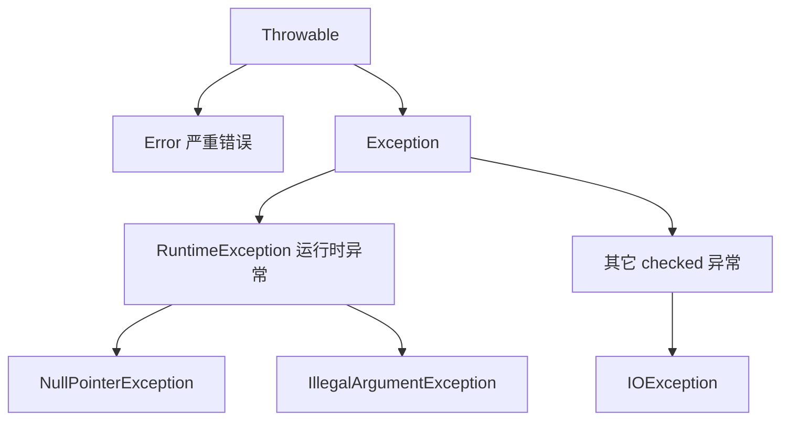

# Java 异常处理

- 异常是 Java 处理“运行期错误”的统一机制。和 C++ 的 try/catch 思路一致，但体系更规范、用得更普遍。

## 基本结构

```java
try {
    int result = 10 / 0;          // 这里会抛出异常
} catch (ArithmeticException e) {  // 捕获特定类型的异常
    System.out.println("出错了: " + e.getMessage());
} finally {
    // 无论是否异常都会执行，常用来释放资源
    System.out.println("清理工作");
}
```

- `try`：放可能出错的代码。
- `catch`：捕获并处理某类异常，可以写多个 catch 匹配不同类型。
- `finally`：一定执行，用于收尾（关文件、关连接）。

## 异常体系



- `Throwable`：所有异常/错误的根。
- `Error`：JVM 级别的严重问题（如内存溢出 OutOfMemoryError），一般不去捕获。
- `Exception`：程序该处理的异常，分两类（见下）。

## checked vs unchecked（Java 特有）

- 这是 C++ 没有的概念，Java 把异常分成两种：

- `checked 异常`（受检）：编译器强制你处理，要么 `try/catch`，要么在方法签名上 `throws` 声明往外抛。典型如 `IOException`。不处理编译不过。
- `unchecked 异常`（非受检，即 RuntimeException 及其子类）：编译器不强制处理，通常代表程序 bug。典型如 `NullPointerException`、`IllegalArgumentException`、数组越界。

```java
// checked 异常：必须声明 throws 或自己 catch
public void readFile(String path) throws java.io.IOException {
    java.nio.file.Files.readAllLines(java.nio.file.Path.of(path));
}

// unchecked 异常：编译器不强制，但运行时可能抛
public int parse(String s) {
    return Integer.parseInt(s); // s 不是数字会抛 NumberFormatException（unchecked）
}
```

## 抛出异常

- 用 `throw` 主动抛出，常用于参数校验：

```java
public void setAge(int age) {
    if (age < 0) {
        // 参数非法时主动抛异常，调用方能立刻知道用错了
        throw new IllegalArgumentException("年龄不能为负: " + age);
    }
    this.age = age;
}
```

## try-with-resources：自动关资源

- 这是 Java 替代 C++ RAII 的机制之一。实现了 `AutoCloseable` 的资源（文件、连接等），写在 try 的括号里，结束时自动关闭，不用手写 finally。

```java
// 括号里声明的资源，try 块结束后会自动调用 close()，即使中途异常也会关
try (var reader = java.nio.file.Files.newBufferedReader(java.nio.file.Path.of("a.txt"))) {
    String line = reader.readLine();
    System.out.println(line);
} catch (java.io.IOException e) {
    System.out.println("读取失败");
}
// 这里 reader 已自动关闭，不需要手动 close
```

## 自定义异常

- 继承 `Exception`（checked）或 `RuntimeException`（unchecked），用来表达业务语义。

```java
public class UserNotFoundException extends RuntimeException {
    public UserNotFoundException(String name) {
        super("找不到用户: " + name); // 把消息传给父类
    }
}
```

## 实践建议

- 不要吞异常：`catch` 里什么都不做是大忌，至少要记日志或重新抛出。
- 捕获要具体：优先 catch 具体类型，少用 `catch (Exception e)` 一把抓。
- 业务错误优先用 unchecked：现代后端框架（如 Spring）大多倾向用 RuntimeException，避免到处写 `throws` 污染签名。
- 异常用于“异常情况”，不要拿它当正常流程的控制手段（抛/抓异常有性能开销）。

## 可运行示例

- 代码：[`examples/exception/ExceptionDemo.java`](examples/exception/ExceptionDemo.java)
- 演示捕获、主动抛出、自定义异常，以及 try-with-resources 自动关闭资源。
- 运行：

```bash
cd Java/examples/exception
java ExceptionDemo.java
```
