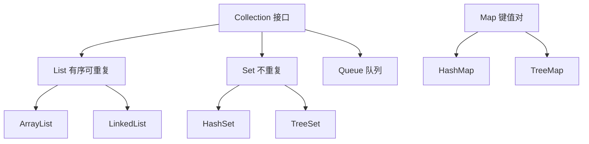

# Java 集合框架

- 集合框架（Collections Framework）是 Java 内置的一套容器，对应你熟悉的 C++ STL。
- 后端开发天天用，重点掌握三类：List、Set、Map。

## 整体结构



- `Collection` 是单个元素集合的总接口；`Map` 是键值对，独立于 Collection。
- 注意：这些容器只能装对象，不能装基本类型，所以用 `List<Integer>` 而不是 `List<int>`（自动装箱帮你处理转换）。

## List：有序、可重复

- 对应 C++ 的 `vector` / `list`。最常用 `ArrayList`。

- `ArrayList`：底层是动态数组，随机访问快（O(1)），中间插入删除慢。对标 `std::vector`。
- `LinkedList`：底层是双向链表，两端操作快，随机访问慢。对标 `std::list`。

```java
import java.util.ArrayList;
import java.util.List;

List<String> names = new ArrayList<>(); // 声明用接口 List，实现用 ArrayList
names.add("Alice");
names.add("Bob");
String first = names.get(0);     // 随机访问，注意是 get(i) 不是 [i]
int n = names.size();            // 元素个数是 size()，数组才是 length
for (String name : names) {      // 遍历
    System.out.println(name);
}
```

- 习惯：变量类型声明成接口 `List`，右边用具体实现 `ArrayList`。这样以后换实现不影响其它代码（面向接口编程）。

## Set：不重复

- 对应 C++ 的 `unordered_set` / `set`。用来去重、判断存在性。

- `HashSet`：基于哈希，无序，增删查平均 O(1)。对标 `std::unordered_set`。
- `TreeSet`：基于红黑树，元素自动按序排列。对标 `std::set`。

```java
import java.util.HashSet;
import java.util.Set;

Set<String> tags = new HashSet<>();
tags.add("a");
tags.add("a");            // 重复添加无效
boolean has = tags.contains("a"); // true
int size = tags.size();   // 1
```

## Map：键值对

- 对应 C++ 的 `unordered_map` / `map`。后端用得最多，比如缓存、索引、计数。

- `HashMap`：哈希实现，无序，平均 O(1)。最常用。对标 `std::unordered_map`。
- `TreeMap`：按 key 排序。对标 `std::map`。

```java
import java.util.HashMap;
import java.util.Map;

Map<String, Integer> ages = new HashMap<>();
ages.put("Alice", 18);            // 放入键值对
ages.put("Bob", 20);
Integer a = ages.get("Alice");    // 取值，key 不存在返回 null
int safe = ages.getOrDefault("X", 0); // key 不存在时给默认值，避免 null
boolean exist = ages.containsKey("Bob");

// 遍历键值对
for (Map.Entry<String, Integer> e : ages.entrySet()) {
    System.out.println(e.getKey() + " = " + e.getValue());
}
```

## 几个高频注意点

- 取不到值返回 `null`：和 C++ map 的 `[]` 自动插入默认值不同，Java 的 `get` 返回 null，用 `getOrDefault` 更安全。如果直接拆箱成 `int`，`null` 会变成 `NullPointerException`。
- 比较元素相等靠 `equals` 和 `hashCode`：自定义类作为 HashMap 的 key 或放进 HashSet 时，必须正确重写这两个方法，否则去重/查找会失效。`record` 会自动帮你生成。
- 哈希容器默认不保证遍历顺序：`HashMap`、`HashSet` 的输出顺序不要依赖。需要稳定插入顺序时，用 `LinkedHashMap` / `LinkedHashSet`。
- 不可变集合：`List.of(...)`、`Map.of(...)` 创建只读集合，适合常量数据，改它会抛异常，也不接受 null 元素。
- 容量初始化：已知大小时给 `new ArrayList<>(1000)` 预留容量，减少扩容拷贝（和 vector 的 reserve 思路一样）。

## 怎么选

- 要有序列表、按下标访问 → `ArrayList`。
- 要去重 → `HashSet`。
- 要 key-value 映射 → `HashMap`。
- 要按 key/元素自动排序 → `TreeMap` / `TreeSet`。
- 绝大多数后端场景，`ArrayList` + `HashMap` 就覆盖了 90%。

## 可运行示例

- 代码：[`examples/collections/CollectionsDemo.java`](examples/collections/CollectionsDemo.java)
- 演示 List / Set / Map 的常用操作，以及用 Map 做词频统计。
- 运行：

```bash
cd Java/examples/collections
java CollectionsDemo.java
```
